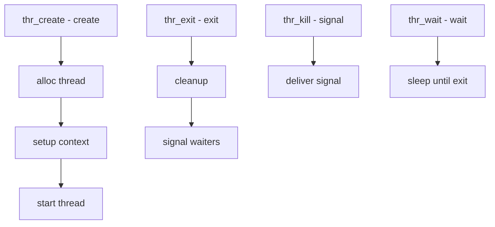

# Component: kern_thr.c

**Path:** `sys/kern/kern_thr.c`
**Type:** File
**Maps to:** `.discovery/sys/kern/kern_thr.md`

## Purpose

Threading syscalls (1:1 model) - implements userland threading syscalls. Creates kernel threads, manages thread lifecycle, and provides synchronization primitives.

## Structure

## Key Functions

| Function | Purpose | Signature |
|----------|---------|-----------|
| `thr_create` | Create thread | `int thr_create(struct thread *td, ...)` |
| `thr_exit` | Exit thread | `void thr_exit(long *state)` |
| `thr_kill` | Signal thread | `int thr_kill(struct thread *td, int sig)` |
| `thr_wait` | Wait for thread | `int thr_wait(long *state)` |
| `thr_self` | Get TID | `int thr_self(long *tdid)` |

## Thread Syscalls

| Call | Description |
|------|-------------|
| `thr_new` | Create new |
| `thr_exit` | Exit |
| `thr_kill` | Send signal |
| `thr_wait` | Wait |
| `thr_self` | Get ID |

## Thread Priority

| Type | Description |
|------|-------------|
| `rtprio` | Real-time priority |
| `idle` | Idle priority |

## Thr Flags

| Flag | Description |
|------|-------------|
| `THR_FLAG_SUSPENDED` | Start suspended |
| `THR_FLAG_SYSTEM` | System thread |

## Ucontext

| Function | Description |
|----------|-------------|
| `swapcontext` | Swap contexts |
| `makecontext` | Modify context |

## Includes

- `sys/thr.h` - Thread definitions

## Depends On

- `sys/proc.h` for process
- `sys/sched.h` for scheduling