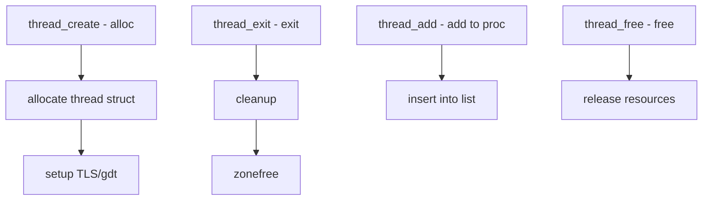

# Component: kern_thread.c

**Path:** `sys/kern/kern_thread.c`
**Type:** File
**Maps to:** `.discovery/sys/kern/kern_thread.md`

## Purpose

Thread management - provides core thread lifecycle management. Handles thread allocation, initialization, and cleanup for kernel threads.

## Structure



## Key Functions

| Function | Purpose | Signature |
|----------|---------|-----------|
| `thread_create` | Create thread | `struct thread *thread_create(...)` |
| `thread_exit` | Exit thread | `void thread_exit(void)` |
| `thread_free` | Free thread | `void thread_free(struct thread *td)` |
| `thread_add` | Add to proc | `void thread_add(struct proc *p, struct thread *td)` |
| `thread_link` | Link thread | `void thread_link(struct thread *td, struct proc *p)` |

## Thread Structure

```c
struct thread {
    struct proc *td_proc;      // Process
    u_int td_tid;             // Thread ID
    struct thread *td_next;   // Next in proc
    struct thread **td_pprev; // Prev ptr
    // ... many more fields
};
```

## Thread Flags

| Flag | Description |
|------|-------------|
| `TD_FLAGS` | General flags |
| `TD_STATE` | State flags |

## Thread States

| State | Description |
|-------|-------------|
| `TD_RUNNING` | Running |
| `TD_RUNNABLE` | Runnable |
| `TD_SLEEPING` | Sleeping |
| `TD_STOPPED` | Stopped |

## TLS Management

| Function | Description |
|----------|-------------|
| `tls_gdt` | TLS GDT entry |

## Epoch Integration

| Feature | Description |
|---------|-------------|
| `SMR` | Safe memory reclamation |

## Includes

- `sys/proc.h` for process

## Depends On

- `sys/sched.h` for scheduling
- `sys/lock.h` for locking