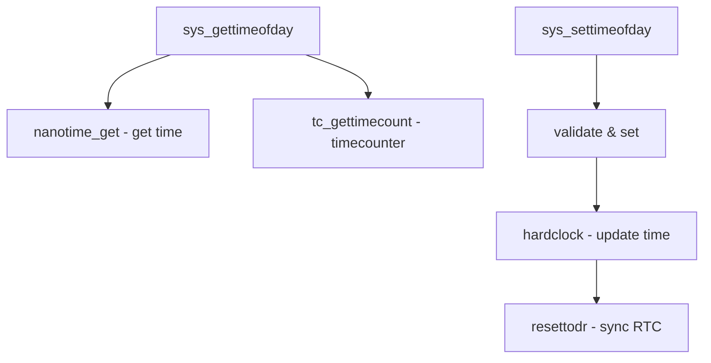

# Component: kern_time.c

**Path:** `sys/kern/kern_time.c`
**Type:** File
**Maps to:** `.discovery/sys/kern/kern_time.md`

## Purpose

Time subsystem - implements time-related syscalls (gettimeofday, settimeofday, adjtime, etc.) and manages kernel timekeeping via the timecounter framework.

## Structure

## Key Functions

| Function | Purpose | Signature |
|----------|---------|-----------|
| `sys_gettimeofday` | Get time of day | `int sys_gettimeofday(struct thread *td, struct gettimeofday_args *uap)` |
| `sys_settimeofday` | Set time of day | `int sys_settimeofday(struct thread *td, struct settimeofday_args *uap)` |
| `sys_adjtime` | Adjust time gradually | `int sys_adjtime(struct thread *td, struct adjtime_args *uap)` |
| `nanotime` | Nanosecond precision time | `void nanotime(struct timespec *ts)` |
| `nanouptime` | Uptime in nanoseconds | `void nanouptime(struct timespec *ts)` |
| `getmicrouptime` | Microsecond uptime | `void getmicrouptime(struct timeval *tv)` |
| `binuptime` | Binary nanoseconds | `void binuptime(struct bintime *bt)` |

## Timecounter Framework

| Component | Description |
|----------|-------------|
| `tc_getfrequency` | Get counter frequency |
| `tc_init` | Initialize timecounter |
| `tc_tick` | Tick handler |
| `tc_givecookie` | Release timecounter |

## Time Sources

| Source | Description |
|-------|-------------|
| `RTC` | Real-time clock (hardware) |
| `TSC` | Time Stamp Counter (x86) |
| `ACPI` | ACPI power management timer |
| `HPET` | High Precision Event Timer |

## Includes

- `sys/time.h` - Time structures
- `sys/timetc.h` - Timecounter interface
- `sys/clock.h` - Clock subsystem

## Depends On

- `kern_ntptime.c` for NTP integration
- Machine-dependent timecounter implementations