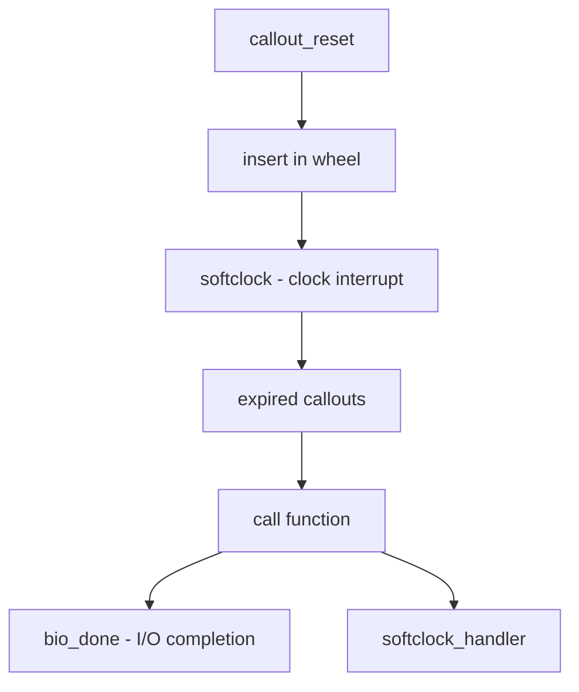

# Component: kern_timeout.c

**Path:** `sys/kern/kern_timeout.c`
**Type:** File
**Maps to:** `.discovery/sys/kern/kern_timeout.md`

## Purpose

Timeout/callout facility - implements callout mechanism for delayed function execution. Provides `timeout(9)` and `callout` functionality for scheduling work to run after a specified time.

## Structure

## Key Functions

| Function | Purpose | Signature |
|----------|---------|-----------|
| `callout_init` | Initialize callout | `void callout_init(struct callout *c, int mtxtype)` |
| `callout_reset` | Reset/start callout | `void callout_reset(struct callout *c, int ticks, void (*func)(void *), void *arg)` |
| `callout_stop` | Stop callout | `void callout_stop(struct callout *c)` |
| `callout_pending` | Is callout pending? | `int callout_pending(struct callout *c)` |
| `callout_active` | Is callout active? | `int callout_active(struct callout *c)` |
| `timeout` | Schedule timeout (legacy) | `void timeout(void (*func)(void *), void *arg, int ticks)` |
| `untimeout` | Cancel timeout | `void untimeout(void (*func)(void *), void *arg)` |
| `softclock` | Softclock handler | `void softclock(void *arg)` |

## Callout States

| State | Description |
|-------|-------------|
| `CALLOUT_ACTIVE` | Callout is running |
| `CALLOUT_PENDING` | In timeout wheel |
| `CALLOUT_MTX Spin` | Uses spin mutex |

## Implementation

Uses a timing wheel data structure:
- `NBBY` = 8 bits per byte
- `CALLWHEELSIZE` = 16 buckets per slot
- `CALLBUCKETS` = hierarchical wheel

## Includes

- `sys/callout.h` - Callout definitions
- `sys/kernel.h` - Kernel definitions
- `machine/atomic.h` - Atomic operations

## Depends On

- `hardclock` for clock interrupts
- Used by all kernel subsystems for delayed work
- `bio.c` for disk I/O timeouts