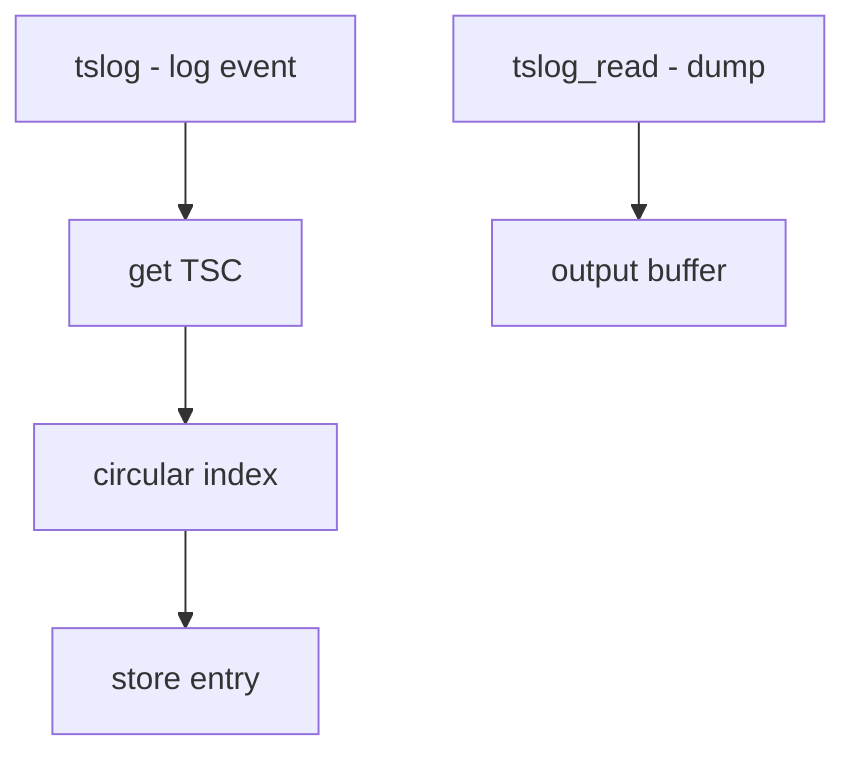

# Component: kern_tslog.c

**Path:** `sys/kern/kern_tslog.c`
**Type:** File
**Maps to:** `.discovery/sys/kern/kern_tslog.md`

## Purpose

Timestamp logging - provides a circular buffer of timestamped log entries. Uses TSC (Time Stamp Counter) for high-resolution timestamps for performance analysis.

## Structure



## Key Functions

| Function | Purpose | Signature |
|----------|---------|-----------|
| `tslog` | Log timestamp | `void tslog(void *td, int type, const char *f, const char *s)` |
| `tslog_read` | Dump log | `int tslog_read(struct sbuf *sb)` |

## Log Entry

```c
struct timestamp {
    void *td;          // Thread
    int type;          // Event type
    const char *f;     // Function
    const char *s;     // String
    uint64_t tsc;      // TSC value
};
```

## Buffer Size

| Size | Description |
|------|-------------|
| `TSLOGSIZE` | Default 262144 |

## Event Types

| Type | Description |
|------|-------------|
| `TSLOG_ENTER` | Function entry |
| `TSLOG_EXIT` | Function exit |

## TSC Usage

| Feature | Description |
|---------|-------------|
| `get_cyclecount` | Read TSC |

## Sysctl

| Node | Description |
|------|-------------|
| `debug.tslog` | Read timestamp log |

## Uses

| Use | Description |
|-----|-------------|
| `boot profiling` | Boot time analysis |
| `performance` | Event timing |

## Includes

- `sys/tslog.h` - Timestamp log definitions

## Depends On

- `machine/cpu.h` for TSC