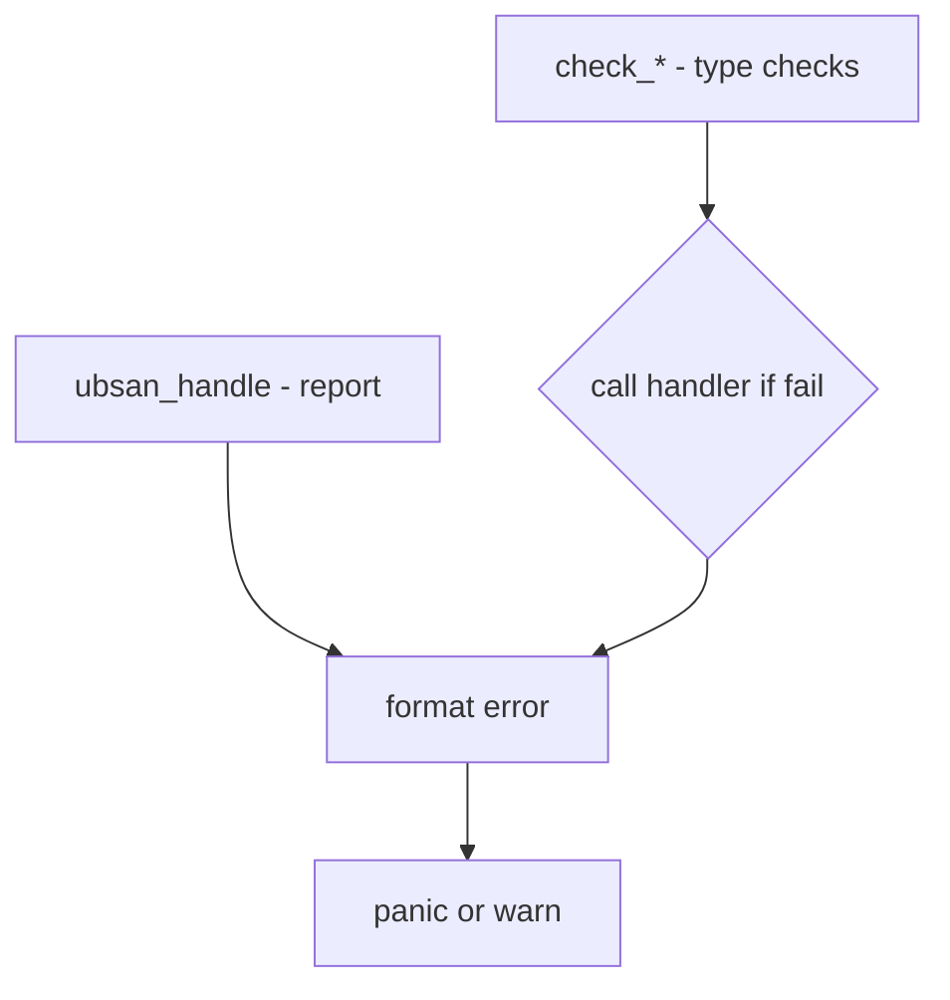

# Component: kern_ubsan.c

**Path:** `sys/kern/kern_ubsan.c`
**Type:** File
**Maps to:** `.discovery/sys/kern/kern_ubsan.md`

## Purpose

UBSan kernel support - undefined behavior sanitizer runtime for kernel. Catches undefined behavior in kernel code compiled with UBSan.

## Structure

## Key Functions

| Function | Purpose | Signature |
|----------|---------|-----------|
| `__ubsan_handle_type_mismatch` | Type mismatch | `void __ubsan_handle_type_mismatch(...)` |
| `__ubsan_handle_shift_out_of_bounds` | Shift error | `void __ubsan_handle_shift_out_of_bounds(...)` |
| `__ubsan_handle_out_of_bounds` | OOB access | `void __ubsan_handle_out_of_bounds(...)` |
| `__ubsan_handle_alignment` | Alignment | `void __ubsan_handle_alignment(...)` |

## UBSan Check Types

| Type | Description |
|------|-------------|
| `type_mismatch` | Wrong type/pointer |
| `shift_out_of_bounds` | Invalid shift |
| `out_of_bounds` | Array bounds |
| `alignment` | Alignment error |
| `null_or_vptr` | Null/invalid |

## Behavior on Error

| Mode | Action |
|------|--------|
| `panic` | Panic kernel |
| `warn` | Print warning |

## Instrumentation

| Feature | Description |
|--------|-------------|
| `__builtin_*` | Compiler builtins |
| `type mismatch` | Pointer type check |

## UBSan Options

| Option | Description |
|--------|-------------|
| `UBSAN_OPTIONS` | Userland options |
| `panic=0` | Don't panic |

## Sources

| Source | Origin |
|--------|--------|
| `NetBSD` | Adapted from NetBSD |

## Includes

- `sys/systm.h` for kernel functions

## Depends On

- `compiler.h` for __builtin