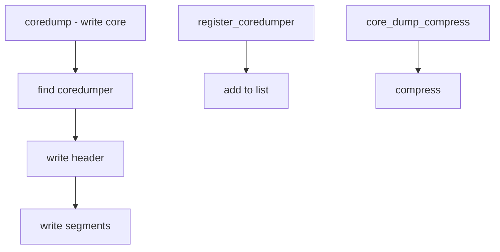

# Component: kern_ucoredump.c

**Path:** `sys/kern/kern_ucoredump.c`
**Type:** File
**Maps to:** `.discovery/sys/kern/kern_ucoredump.md`

## Purpose

User core dump - writes process core dumps when a process crashes. Handles core file generation for user processes.

## Structure



## Key Functions

| Function | Purpose | Signature |
|----------|---------|-----------|
| `coredump` | Write core | `int coredump(struct thread *td, const char **pdp)` |
| `register_coredumper` | Register | `void register_coredumper(struct coredumper *c)` |
| `unregister_coredumper` | Unregister | `void unregister_coredumper(struct coredumper *c)` |

## Core Dumper Structure

```c
struct coredumper {
    SLIST_ENTRY(coredumper) cd_next;
    int (*cd_dump)(struct thread *td, int fd);
    const char *cd_name;
};
```

## Core Dump Compression

| Setting | Description |
|---------|-------------|
| `compress_user_cores` | Compression flag |

## Core Dump Format

| Section | Description |
|---------|-------------|
| `elfhdr` | ELF header |
| `phdr` | Program headers |
| `note` | Process info |
| `segment` | Memory pages |

## Core Dump Flags

| Flag | Description |
|------|-------------|
| `COREDUMP_compress` | Compress |
| `COREDUMP_flop` | To floppy |

## Registration

```c
REGISTER_COREDUMPER(struct coredumper *c);
```

## Includes

- `sys/ucoredump.h` - User core definitions

## Depends On

- `kern_sig.c` for signal handling