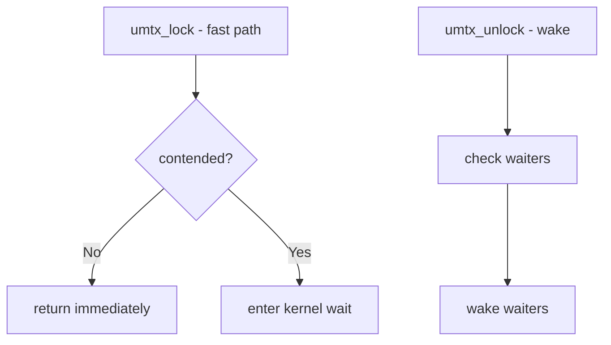

# Component: kern_umtx.c

**Path:** `sys/kern/kern_umtx.c`
**Type:** File
**Maps to:** `.discovery/sys/kern/kern_umtx.md`

## Purpose

Userspace mutex (umtx) - implements futex-like userspace synchronization primitives. Provides fast mutex, rwlock, condvar, and semaphores that can fall back to kernel waits.

## Structure



## Key Functions

| Function | Purpose | Signature |
|----------|---------|-----------|
| `umtx_lock` | Lock mutex | `int umtx_lock(struct thread *td, struct umtx_key *key)` |
| `umtx_unlock` | Unlock | `int umtx_unlock(struct thread *td, struct umtx_key *key)` |
| `umtx_rdlock` | Read lock | `int umtx_rdlock(struct thread *td, struct umtx_key *key)` |
| `umtx_wrlock` | Write lock | `int umtx_wrlock(struct thread *td, struct umtx_key *key)` |
| `umtx_wait` | Wait | `int umtx_wait(struct thread *td, void *addr, uint32_t val, int timeout)` |
| `umtx_wake` | Wake | `int umtx_wake(struct thread *td, void *addr, int nr_wake)` |

## Umtx Operations

| Op | Description |
|----|-------------|
| `UMTX_OP_LOCK` | Acquire mutex |
| `UMTX_OP_UNLOCK` | Release mutex |
| `UMTX_OP_WAIT` | Wait on value |
| `UMTX_OP_WAKE` | Wake waiters |
| `UMTX_OP_RW_RDLOCK` | Read lock |
| `UMTX_OP_RW_WRLOCK` | Write lock |

## Umtx Key

```c
struct umtx_key {
    union {
        struct umtx_q *uq;
        uintptr_t addr;
    } key;
    int type;
};
```

## Lock Types

| Type | Description |
|------|-------------|
| `UMUTEX_UNLOCKED` | Unlocked |
| `UMUTEX_LOCKED` | Locked |
| `UMUTEX_CONTENDED` | Has waiters |

## Timeout

| Type | Description |
|------|-------------|
| `UMTX_ABSTIME` | Absolute time |
| `UMTX_RELTIME` | Relative time |

## Includes

- `sys/umtx.h` - Umtx definitions

## Depends On

- `sys/proc.h` for process