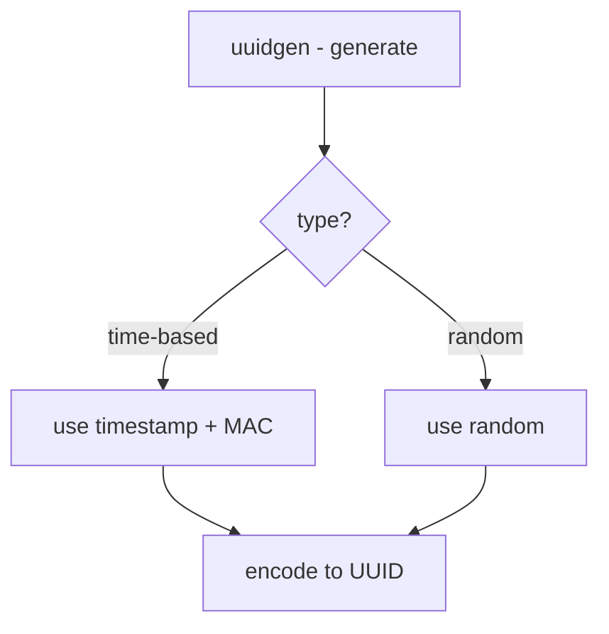

# Component: kern_uuid.c

**Path:** `sys/kern/kern_uuid.c`
**Type:** File
**Maps to:** `.discovery/sys/kern/kern_uuid.md`

## Purpose

UUID generation - implements UUID (Universally Unique Identifier) generation. Creates time-based UUIDs using MAC address and timestamp.

## Structure



## Key Functions

| Function | Purpose | Signature |
|----------|---------|-----------|
| `uuidgen` | Generate UUIDs | `void uuidgen(struct uuid *store, int count)` |
| `kern_uuidgen` | Kernel gen | `int kern_uuidgen(struct uuid *store, int count)` |
| `uuid_dec_le` | Decode LE | `void uuid_dec_le(const struct uuid *uuid, uint8_t *buf)` |
| `uuid_enc_le` | Encode LE | `void uuid_enc_le(void *buf, const struct uuid *uuid)` |

## UUID Structure

```c
struct uuid {
    uint32_t time_low;
    uint16_t time_mid;
    uint16_t time_hi_and_version;
    uint8_t clock_seq_hi_and_reserved;
    uint8_t clock_seq_low;
    uint8_t node[6];
};
```

## UUID Versions

| Version | Description |
|---------|-------------|
| `1` | Time-based |
| `4` | Random |

## UUID Format

```
xxxxxxxx-xxxx-xxxx-xxxx-xxxxxxxxxxxx
```

## Node ID

| Source | Description |
|--------|-------------|
| `MAC` | Network MAC |
| `random` | Random node ID |

## DCE Compatibility

| Standard | Description |
|----------|-------------|
| `RFC 4122` | UUID spec |
| `DCE` | Distributed Computing |

## Includes

- `sys/uuid.h` - UUID definitions

## Depends On

- `net/if.h` for MAC address