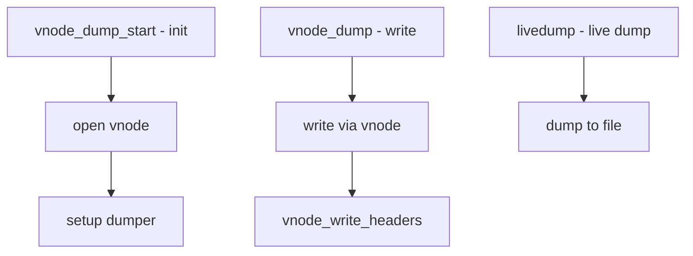

# Component: kern_vnodedumper.c

**Path:** `sys/kern/kern_vnodedumper.c`
**Type:** File
**Maps to:** `.discovery/sys/kern/kern_vnodedumper.md`

## Purpose

Vnode dumper - writes crash dumps to a vnode (file) instead of raw device. Allows crash dumps to any filesystem-backed file.

## Structure

## Key Functions

| Function | Purpose | Signature |
|----------|---------|-----------|
| `vnode_dumper_start` | Start dumper | `static int vnode_dumper_start(void)` |
| `vnode_dump` | Dump function | `static int vnode_dump(...)` |
| `vnode_write_headers` | Write headers | `static dumper_hdr_t vnode_write_headers(...)` |
| `livedump` | Live dump | `int livedump(struct thread *td, int fd)` |

## Dumper Interface

| Function | Description |
|----------|-------------|
| `dumper_start` | Start dumping |
| `dumper` | Write dump |
| `dumper_hdr_t` | Header writer |

## Vnode Dump

| Feature | Description |
|---------|-------------|
| `minidump` | Compressed dump |
| `full dump` | Full memory |

## Uses

| Use | Description |
|-----|-------------|
| `crash dump` | Kernel panic dump |
| `live dump` | Running system |

## Dump Header

| Header | Description |
|--------|-------------|
| `kerneldumpheader` | Dump metadata |

## Includes

- `sys/kerneldump.h` - Dump definitions

## Depends On

- `kern_dump.c` for dump infrastructure
- `vfs/vnode.h` for vnode operations