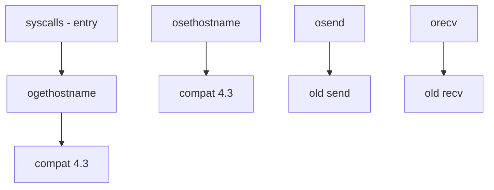

# Component: kern_xxx.c

**Path:** `sys/kern/kern_xxx.c`
**Type:** File
**Maps to:** `.discovery/sys/kern/kern_xxx.md`

## Purpose

Miscellaneous syscalls - contains legacy and compatibility syscalls. Includes old hostname, osend/recv, and other obsolete interfaces.

## Structure

## Syscalls

| Call | Description |
|------|-------------|
| `ogethostname` | Old get hostname |
| `osethostname` | Old set hostname |
| `osend` | Old send (4.2) |
| `orecv` | Old recv (4.2) |

## Compatibility

| Type | Description |
|------|-------------|
| `COMPAT_43` | 4.3 BSD compat |
| `COMPAT_FREEBSD4` | FreeBSD 4 compat |

## Functions

| Function | Purpose |
|----------|---------|
| `ogethostname` | Get hostname |
| `osethostname` | Set hostname |
| `userland_sysctl` | Userland sysctl |

## Old Interface

| Interface | Modern Replacement |
|-----------|-------------------|
| `ogethostname` | `sysctl` kern.hostname |
| `osend` | `sendto` |
| `orecv` | `recvfrom` |

## Includes

- `sys/sysproto.h` for syscall args

## Depends On

- `sys/sysent.h` for syscall entry