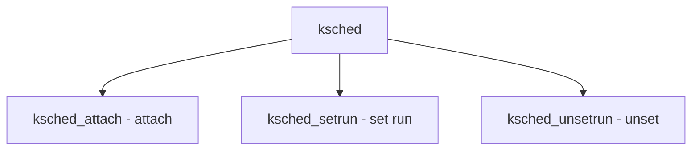

# Component: ksched.c

**Path:** `sys/kern/ksched.c`
**Type:** File
**Maps to:** `.discovery/sys/kern/ksched.md`

## Purpose

Kernel scheduler - soft real-time scheduling with POSIX priority. Implements POSIX.1b scheduling for kernel.

## Structure



## Key Functions

| Function | Purpose | Signature |
|----------|---------|-----------|
| `ksched_attach` | Attach | `int ksched_attach(struct ksched **p)` |
| `ksched_setrun` | Set run | `int ksched_setrun(struct thread *td)` |
| `ksched_unsetrun` | Unset run | `int ksched_unsetrun(struct thread *td)` |

## Ksched Structure

```c
struct ksched {
    struct timespec rr_interval;  // RR interval
};
```

## Real-Time Priority

| Type | Description |
|------|-------------|
| `rtprio` | Real-time priority |

## Features

| Feature | Description |
|---------|-------------|
| `P1003_1B` | POSIX real-time |
| `RR` | Round-robin |

## Includes

- `sys/sched.h` - Scheduler definitions
- `sys/posix4.h` - POSIX.4