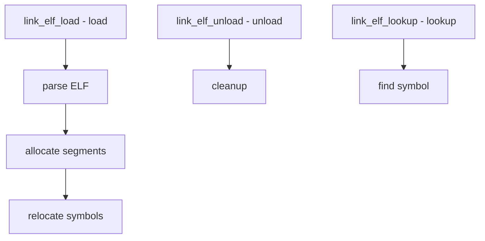

# Component: link_elf.c

**Path:** `sys/kern/link_elf.c`
**Type:** File
**Maps to:** `.discovery/sys/kern/link_elf.md`

## Purpose

ELF kernel linker - loads and links ELF kernel modules. Handles KLD (Kernel Loadable Driver) loading via kldload.

## Structure



## Key Functions

| Function | Purpose | Signature |
|----------|---------|-----------|
| `link_elf_load` | Load module | `int link_elf_load(struct linker_file *lf)` |
| `link_elf_unload` | Unload module | `int link_elf_unload(struct linker_file *lf)` |
| `link_elf_lookup` | Lookup symbol | `caddr_t link_elf_lookup(struct linker_file *lf, ...)` |
| `link_elf_symbol_values` | Get symbol | `int link_elf_symbol_values(...)` |

## Linker File

```c
struct linker_file {
    const char *filename;    // Module name
    struct preloaded_file *pf;  // Preloaded file
    caddr_t address;        // Load address
    size_t size;           // Size
    // ...
};
```

## Module Types

| Type | Description |
|------|-------------|
| `KLD` | Kernel module |
| `ELF` | ELF format |

## Symbol Tables

| Table | Description |
|-------|-------------|
| `.symtab` | Symbol table |
| `.strtab` | String table |
| `.dynsym` | Dynamic symbols |

## Relocation

| Type | Description |
|------|-------------|
| `REL` | Relocations |
| `RELA` | Relocations with addend |

## Dependencies

| Dependency | Description |
|------------|-------------|
| `kern_khelp` | Helpers |
| `kern_ctf` | CTF types |

## Includes

- `sys/linker.h` for linker definitions

## Depends On

- `kern_khelp.c` for helpers
- `kern_ctf.c` for CTF