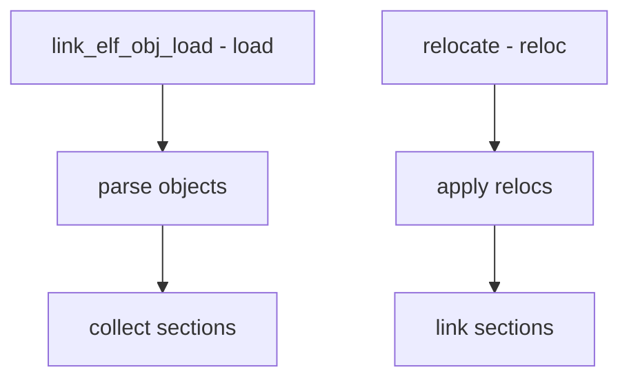

# Component: link_elf_obj.c

**Path:** `sys/kern/link_elf_obj.c`
**Type:** File
**Maps to:** `.discovery/sys/kern/link_elf_obj.md`

## Purpose

ELF object linker - links multiple ELF object files into a kernel module. Similar to link_elf.c but handles multi-object modules.

## Structure

## Key Functions

| Function | Purpose | Signature |
|----------|---------|-----------|
| `link_elf_obj_load` | Load objects | `int link_elf_obj_load(struct linker_file *lf)` |
| `link_elf_obj_unload` | Unload | `int link_elf_obj_unload(struct linker_file *lf)` |
| `link_elf_obj_lookup` | Lookup | `caddr_t link_elf_obj_lookup(...)` |

## Object Files

| Feature | Description |
|---------|-------------|
| `multiple` | Multiple .o files |
| `archive` | .a archive |

## Section Types

| Type | Description |
|------|-------------|
| `.text` | Code |
| `.data` | Data |
| `.bss` | Uninit data |
| `.rel*` | Relocations |

## Linking Steps

| Step | Description |
|------|-------------|
| `parse` | Read objects |
| `combine` | Merge sections |
| `relocate` | Apply relocs |

## Relocation

| Type | Description |
|------|-------------|
| `REL` | With addend |
| `RELA` | Without |

## Includes

- `sys/linker.h` for linker definitions

## Depends On

- `link_elf.c` for base