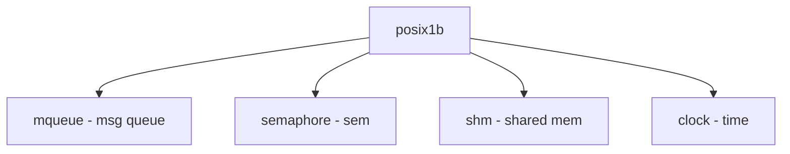

# Component: p1003_1b.c

**Path:** `sys/kern/p1003_1b.c`
**Type:** File
**Maps to:** `.discovery/sys/kern/p1003_1b.md`

## Purpose

POSIX.1b (Real-Time) - implementation of POSIX real-time extensions. Provides mq_open, sem_open, clock_getres, and other real-time syscalls.

## Structure

## Key Features

| Feature | Description |
|---------|-------------|
| `mq_open` | Message queues |
| `sem_open` | Semaphores |
| `shm_open` | Shared memory |
| `clock_getres` | Clock res |

## Message Queues

| Function | Description |
|----------|-------------|
| `mq_open` | Open queue |
| `mq_close` | Close |
| `mq_send` | Send |
| `mq_receive` | Receive |

## Semaphores

| Function | Description |
|----------|-------------|
| `sem_open` | Open |
| `sem_close` | Close |
| `sem_wait` | Wait |
| `sem_post` | Post |

## Includes

- `sys/posix4.h` - POSIX.4 definitions
- `sys/mqueue.h` - Message queue