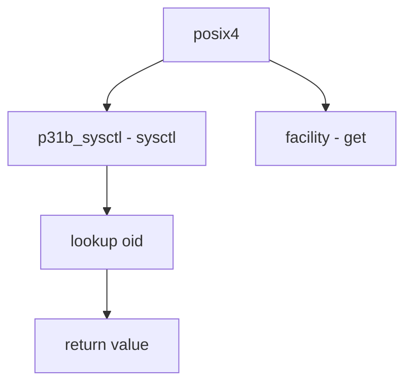

# Component: posix4_mib.c

**Path:** `sys/kern/posix4_mib.c`
**Type:** File
**Maps to:** `.discovery/sys/kern/posix4_mib.md`

## Purpose

POSIX.1e MIB - system configuration for POSIX.1e facilities. Provides sysctl nodes for POSIX.1b (real-time) and POSIX.1c (threads) options.

## Structure

## Key Functions

| Function | Purpose | Signature |
|----------|---------|-----------|
| `p31b_sysctl_proc` | Sysctl | `int p31b_sysctl_proc(SYSCTL_HANDLER_ARGS)` |

## Facilities

| Facility | Description |
|----------|-------------|
| `CTL_P1003_1B_MAXID` | Max ID |

## Sysctl Nodes

| Node | Description |
|------|-------------|
| `_p1003_1b` | POSIX.1b |

## Options

| Option | Description |
|--------|-------------|
| `POSIX` | Real-time |
| `THREAD` | Threads |

## Includes

- `sys/posix4.h` - POSIX.4 definitions