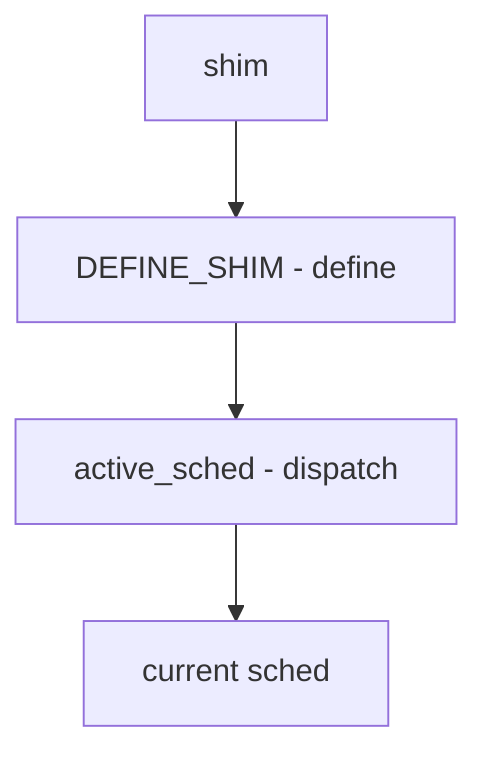

# Component: sched_shim.c

**Path:** `sys/kern/sched_shim.c`
**Type:** File
**Maps to:** `.discovery/sys/kern/sched_shim.md`

## Purpose

Scheduler shim - runtime scheduler selection. Provides indirection through active_sched pointer to allow swapping scheduler implementations.

## Structure

## Key Variables

| Variable | Description |
|----------|-------------|
| `active_sched` | Active scheduler |

## Shims

| Shim | Description |
|------|-------------|
| `sched_load` | Load |
| `sched_runnable` | Runnable |
| `sched_fork` | Fork |
| `sched_exit` | Exit |
| `sched_class` | Class |
| `sched_nice` | Nice |
| `sched_estcpu` | Est CPU |

## Scheduler Selection

| Feature | Description |
|---------|-------------|
| `4BSD` | Legacy |
| `ULE` | Current |

## Use Cases

| Use | Description |
|-----|-------------|
| `runtime` | Runtime switch |
| `module` | Scheduler module |

## Includes

- `sys/sched.h` - Scheduler definitions