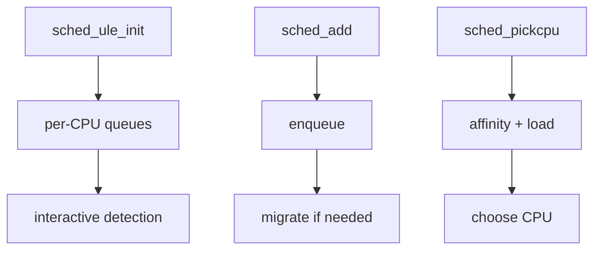

# Component: sched_ule.c

**Path:** `sys/kern/sched_ule.c`
**Type:** File
**Maps to:** `.discovery/sys/kern/sched_ule.md`

## Purpose

ULE scheduler - the modern FreeBSD default scheduler. Provides per-CPU run queues, better interactive performance, and fine-grained locking.

## Structure

## Key Functions

| Function | Purpose | Signature |
|----------|---------|-----------|
| `sched_ule_init` | Initialize | `void sched_ule_init(void)` |
| `sched_ule_add` | Add thread | `void sched_ule_add(struct thread *td)` |
| `sched_ule_rem` | Remove thread | `void sched_ule_rem(struct thread *td)` |
| `sched_ule_setpri` | Set priority | `void sched_ule_setpri(struct thread *td, u_char pri)` |
| `sched_ule_pickcpu` | Pick CPU | `int sched_ule_pickcpu(struct thread *td)` |
| `sched_ule_dequeue` | Dequeue | `void sched_ule_dequeue(struct thread *td, int flags)` |

## Per-CPU Queues

| Feature | Description |
|---------|-------------|
| `TDQ_RUNQ` | Per-CPU run queues |
| `CPU Buncing` | Group CPUs |

## Interactive Detection

| Metric | Description |
|--------|-------------|
| `sleeptime` | Sleep vs run time |
| `cpu_use` | CPU consumption |

## Priorities

| Class | Description |
|-------|-------------|
| `TS priority` | Time-sharing |
| `REALTIME` | Real-time |
| `IDLE` | Idle |

## Load Balancing

| Mechanism | Description |
|-----------|-------------|
| `steal` | steal from idle |
| `migrate` | thread migration |

## Includes

- `sys/sched.h` for scheduler definitions

## Depends On

- `sys/proc.h` for process
- `sys/smp.h` for SMP