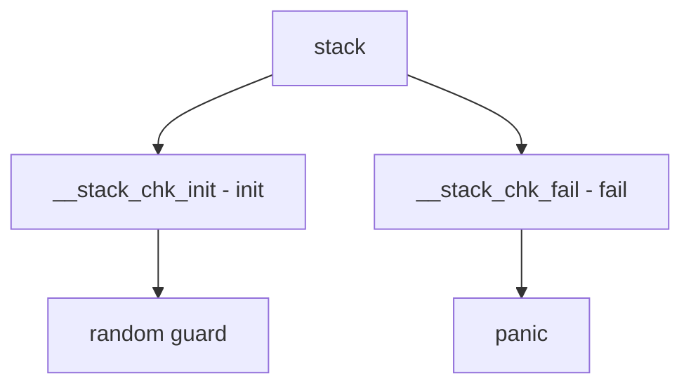

# Component: stack_protector.c

**Path:** `sys/kern/stack_protector.c`
**Type:** File
**Maps to:** `.discovery/sys/kern/stack_protector.md`

## Purpose

Stack protector - stack overflow detection. Provides stack canary to detect stack buffer overflows.

## Structure



## Key Functions

| Function | Purpose | Signature |
|----------|---------|-----------|
| `__stack_chk_init` | Init | `void __stack_chk_init(void)` |
| `__stack_chk_fail` | Fail | `void __stack_chk_fail(void)` |

## Stack Guard

```c
long __stack_chk_guard[8];
```

## Protection

| Feature | Description |
|---------|-------------|
| `canary` | Stack canary |
| `random` | Random guard |

## Initialization

| Phase | Description |
|-------|-------------|
| `SI_SUB_RANDOM` | Random phase |

## Use Cases

| Use | Description |
|-----|-------------|
| `overflow` | Buffer overflow |
| `security` | Stack smashing |

## Includes

- `sys/libkern.h` - Kernel lib