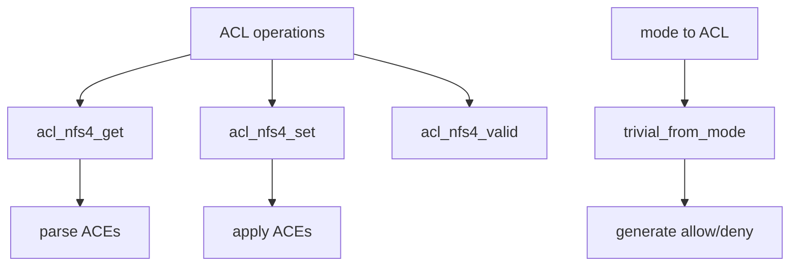

# Component: subr_acl_nfs4.c

**Path:** `sys/kern/subr_acl_nfs4.c`
**Type:** File
**Maps to:** `.discovery/sys/kern/subr_acl_nfs4.md`

## Purpose

NFSv4 ACL support - provides ACL manipulation routines for NFSv4 access control lists. Implements ACL <-> mode conversion, ACE parsing, and NFSv4 ACL semantics.

## Structure



## Key Functions

| Function | Purpose | Signature |
|----------|---------|-----------|
| `acl_nfs4_get` | Get ACL | `int acl_nfs4_get(struct ucred *cred, struct vnode *vp, struct acl *aclp)` |
| `acl_nfs4_set` | Set ACL | `int acl_nfs4_set(struct ucred *cred, struct vnode *vp, struct acl *aclp)` |
| `acl_nfs4_valid` | Validate | `int acl_nfs4_valid(struct acl *aclp)` |
| `acl_nfs4_trivial_from_mode` | Mode to ACL | `void acl_nfs4_trivial_from_mode(struct acl *aclp, mode_t mode)` |
| `acl_nfs4_mode_to_acl` | Mode conversion | `int acl_nfs4_mode_to_acl(struct vnode *vp, struct acl *aclp)` |

## ACE Types

| Type | Description |
|------|-------------|
| `NFS4_ACE_ACCESS_ALLOWED_ACE_TYPE` | Allow access |
| `NFS4_ACE_ACCESS_DENIED_ACE_TYPE` | Deny access |
| `NFS4_ACE_SYSTEM_AUDIT_ACE_TYPE` | Audit access |

## Who Values

| Who | Description |
|-----|-------------|
| `NFS4_ACE_OWNER` | Owner |
| `NFS4_ACE_GROUP` | Group |
| `NFS4_ACE_EVERYONE` | Everyone |

## Flags

| Flag | Description |
|------|-------------|
| `NFS4_ACE_FILE_INHERIT` | Inherit to files |
| `NFS4_ACE_DIRECTORY_INHERIT` | Inherit to dirs |
| `NFS4_ACE_NO_PROPAGATE` | Don't propagate |
| `NFS4_ACE_INHERIT_ONLY` | Inheritance only |

## ACL Structure

```c
struct acl {
    int acl_cnt;           // ACE count
    struct acl_entry acl_entry[ACL_MAX_ENTRIES];
};
```

## Permissions

| Perm | Description |
|------|-------------|
| `NFS4_ACE_READ_DATA` | Read data |
| `NFS4_ACE_WRITE_DATA` | Write data |
| `NFS4_ACE_APPEND_DATA` | Append |
| `NFS4_ACE_READ_NAMED` | Read named |
| `NFS4_ACE_WRITE_NAMED` | Write named |
| `NFS4_ACE_EXECUTE` | Execute |
| `NFS4_ACE_DELETE` | Delete |
| `NFS4_ACE_READ_ATT` | Read attrs |
| `NFS4_ACE_WRITE_ATT` | Write attrs |

## Includes

- `sys/acl.h` - ACL definitions
- `sys/vnode.h` - Vnode operations

## Depends On

- `sys/priv.h` - Privilege checking