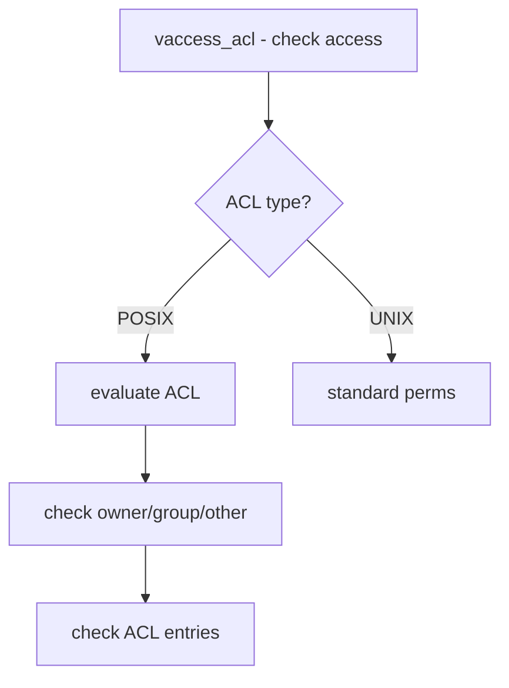

# Component: subr_acl_posix1e.c

**Path:** `sys/kern/subr_acl_posix1e.c`
**Type:** File
**Maps to:** `.discovery/sys/kern/subr_acl_posix1e.md`

## Purpose

POSIX.1e ACL support - utility routines for POSIX.1e Access Control Lists. Provides functions for working with ACLs in a file-system independent way.

## Structure



## Key Functions

| Function | Purpose | Signature |
|----------|---------|-----------|
| `vaccess_acl_posix1e` | Check with ACL | `int vaccess_acl_posix1e(...)` |
| `acl_posix1e_new` | Create ACL | `struct acl *acl_posix1e_new()` |
| `acl_posix1e_copy` | Copy ACL | `void acl_posix1e_copy(struct acl *src, struct acl *dst)` |
| `acl_posix1e_free` | Free ACL | `void acl_posix1e_free(struct acl *acl)` |

## ACL Types

| Type | Description |
|------|-------------|
| `ACL_TYPE_ACCESS` | Access ACL |
| `ACL_TYPE_DEFAULT` | Default ACL |
| `ACL_TYPE_NFS4` | NFSv4 ACL |

## ACL Structure

```c
struct acl {
    int acl_cnt;          // Entry count
    struct acl_entry acl_entry[ACL_MAX_ENTRIES];
};
```

## ACL Entries

| Type | Description |
|------|-------------|
| `ACL_USER_OBJ` | Owner |
| `ACL_GROUP_OBJ` | Group |
| `ACL_OTHER` | Others |
| `ACL_USER` | Named user |
| `ACL_GROUP` | Named group |
| `ACL_MASK` | Mask |

## Permission Bits

| Bit | Description |
|-----|-------------|
| `ACL_READ` | Read |
| `ACL_WRITE` | Write |
| `ACL_EXECUTE` | Execute |

## Includes

- `sys/acl.h` - ACL definitions

## Depends On

- `sys/vnode.h` for vnode ops