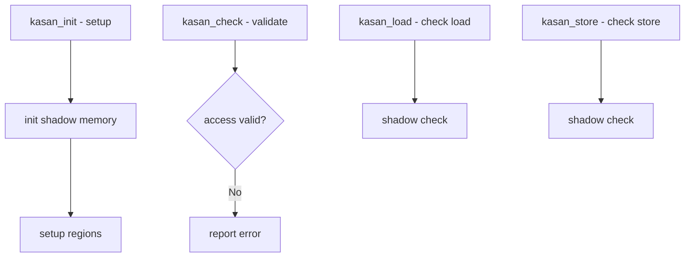

# Component: subr_asan.c

**Path:** `sys/kern/subr_asan.c`
**Type:** File
**Maps to:** `.discovery/sys/kern/subr_asan.md`

## Purpose

AddressSanitizer (KASAN) - kernel memory error detector. Runtime support for detecting use-after-free, buffer overflow, and other memory errors.

## Structure

## Key Functions

| Function | Purpose | Signature |
|----------|---------|-----------|
| `kasan_init` | Initialize | `void kasan_init(void)` |
| `kasan_check` | Generic check | `void kasan_check(const void *addr, size_t size, int rw)` |
| `kasan_load` | Check load | `void kasan_load(const void *addr, size_t size)` |
| `kasan_store` | Check store | `void kasan_store(void *addr, size_t size)` |

## Shadow Memory

| Feature | Description |
|---------|-------------|
| `KASAN_SHADOW_SCALE` | 8:1 mapping |
| `shadow memory` | Red zones |

## Error Types

| Type | Description |
|------|-------------|
| `KASAN_ERR_URAV` | Use after free |
| `KASAN_ERR_BOUNDS` | Buffer overflow |
| `KASAN_ERR_MEMCPY` | Bad memcpy |

## KASAN Reports

| Info | Description |
|------|-------------|
| `pc` | Program counter |
| `addr` | Access address |
| `size` | Access size |
| `type` | Load/store |

## Compiler ABI

| Version | Description |
|---------|-------------|
| `ASAN_ABI_VERSION` | ABI version |

## Sources

| Source | Origin |
|--------|--------|
| `NetBSD` | Adapted from NetBSD |

## Includes

- `sys/asan.h` - ASAN definitions

## Depends On

- `machine/asan.h` for MD support