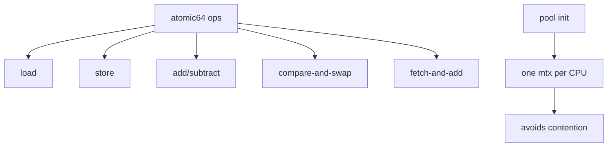

# Component: subr_atomic64.c

**Path:** `sys/kern/subr_atomic64.c`
**Type:** File
**Maps to:** `.discovery/sys/kern/subr_atomic64.md`

## Purpose

64-bit atomic operations - provides atomic operations on 64-bit values for architectures that don't have native 64-bit atomics.

## Structure



## Key Functions

| Function | Purpose | Signature |
|----------|---------|-----------|
| `atomic64_add` | Add | `void atomic64_add(volatile uint64_t *p, uint64_t v)` |
| `atomic64_subtract` | Subtract | `void atomic64_subtract(volatile uint64_t *p, uint64_t v)` |
| `atomic64_load` | Load | `uint64_t atomic64_load(volatile uint64_t *p)` |
| `atomic64_store` | Store | `void atomic64_store(volatile uint64_t *p, uint64_t v)` |
| `atomic64_set` | Set | `void atomic64_set(volatile uint64_t *p, uint64_t v)` |
| `atomic64_swap` | Swap | `uint64_t atomic64_swap(volatile uint64_t *p, uint64_t v)` |
| `atomic64_cmpset` | CAS | `int atomic64_cmpset(volatile uint64_t *p, uint64_t old, uint64_t new)` |
| `atomic64_fetchadd` | Fetch+Add | `uint64_t atomic64_fetchadd(volatile uint64_t *p, uint64_t v)` |
| `atomic64_clear` | Clear | `void atomic64_clear(volatile uint64_t *p)` |

## Operations

| Operation | Description |
|----------|-------------|
| `ATOMIC64_ADD` | Add operation |
| `ATOMIC64_CLEAR` | Clear operation |
| `ATOMIC64_CMPSET` | Compare-and-set |
| `ATOMIC64_FCMPSET` | Faultable CAS |
| `ATOMIC64_FETCHADD` | Fetch and add |
| `ATOMIC64_LOAD` | Load value |
| `ATOMIC64_SET` | Set value |
| `ATOMIC64_STORE` | Store value |
| `ATOMIC64_SWAP` | Swap value |

## Pool Structure

```c
static struct mtx a64_mtx_pool[MAXCPU];  // One lock per CPU
```

## Design

| Feature | Description |
|--------|-------------|
| `lock-based` | Uses mutex pool |
| `per-CPU` | Reduces contention |
| `cacheline` | Align to cache line |

## Includes

- `machine/atomic.h` - Machine atomic ops
- `vm/vm.h` - VM definitions
- `vm/pmap.h` - Physical map