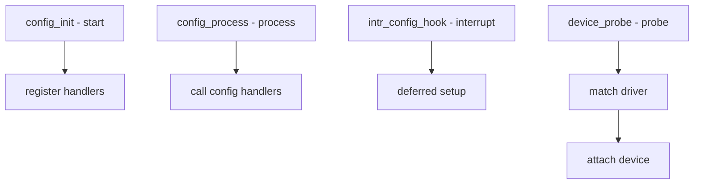

# Component: subr_autoconf.c

**Path:** `sys/kern/subr_autoconf.c`
**Type:** File
**Maps to:** `.discovery/sys/kern/subr_autoconf.md`

## Purpose

Autoconfiguration - device configuration and probing support. Handles device probe/attach sequences and configuration hooks during boot.

## Structure

## Key Functions

| Function | Purpose | Signature |
|----------|---------|-----------|
| `config_init` | Initialize | `void config_init(void)` |
| `config_process` | Process config | `void config_process(void)` |
| `config_intrhook` | Register hook | `void config_intrhook(struct intr_config_hook *hook)` |
| `config_intrhook_establish` | Setup hook | `void config_intrhook_establish(...)` |
| `device_probe` | Probe device | `int device_probe(device_t dev)` |
| `device_attach` | Attach device | `int device_attach(device_t dev)` |

## Configuration Hooks

| Type | Description |
|------|-------------|
| `INTR_CONFIG_HOOK` | Interrupt config |

## Device States

| State | Description |
|-------|-------------|
| `DEVICE_PROBE` | Probing |
| `DEVICE_ATTACH` | Attaching |
| `DEVICE_READY` | Ready |
| `DEVICE_DELETE` | Detaching |

## Bus Architecture

| Component | Description |
|-----------|-------------|
| `bus` | Parent bus |
| `device` | Child device |

## Driver Methods

| Method | Description |
|--------|-------------|
| `probe` | Match device |
| `attach` | Setup device |
| `detach` | Remove device |

## Includes

- `sys/device.h` for device definitions

## Depends On

- `sys/bus.h` for bus framework