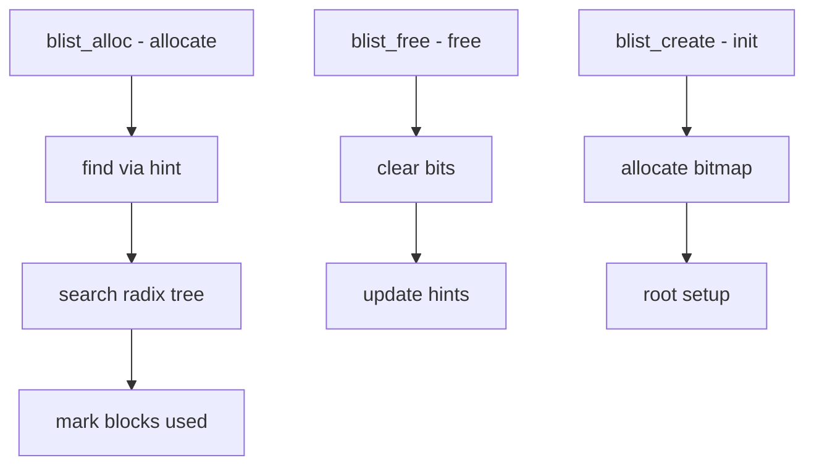

# Component: subr_blist.c

**Path:** `sys/kern/subr_blist.c`
**Type:** File
**Maps to:** `.discovery/sys/kern/subr_blist.md`

## Purpose

Bitmap allocator - radix-tree based block allocator. Manages allocation of blocks using an efficient bitmap with hinting for fast allocation.

## Structure

## Key Functions

| Function | Purpose | Signature |
|----------|---------|-----------|
| `blist_alloc` | Allocate blocks | `int blist_alloc(struct blist *bl, int count)` |
| `blist_free` | Free blocks | `void blist_free(struct blist *bl, int start, int count)` |
| `blist_create` | Create blist | `struct blist *blist_create(int count, int bshift)` |
| `blist_destroy` | Destroy | `void blist_destroy(struct blist *bl)` |

## Radix Tree

| Component | Description |
|-----------|-------------|
| `leaf` | Block bitmap |
| `meta` | Interior node |

## Hint Field

| Property | Description |
|----------|-------------|
| `hint` | Upper bound on alloc |
| `updates` | On alloc/free |

## Block Size

| Parameter | Description |
|-----------|-------------|
| `bshift` | Block size shift |

## Usage

| Use | Description |
|-----|-------------|
| `swap` | Swap block management |
| `vm` | VM extent maps |

## Memory

| Feature | Description |
|---------|-------------|
| `wired` | No dynamic alloc |
| `2 bits/block` | Memory overhead |

## Includes

- `sys/blist.h` - Bitmap list definitions

## Depends On

- `sys/malloc.h` for memory