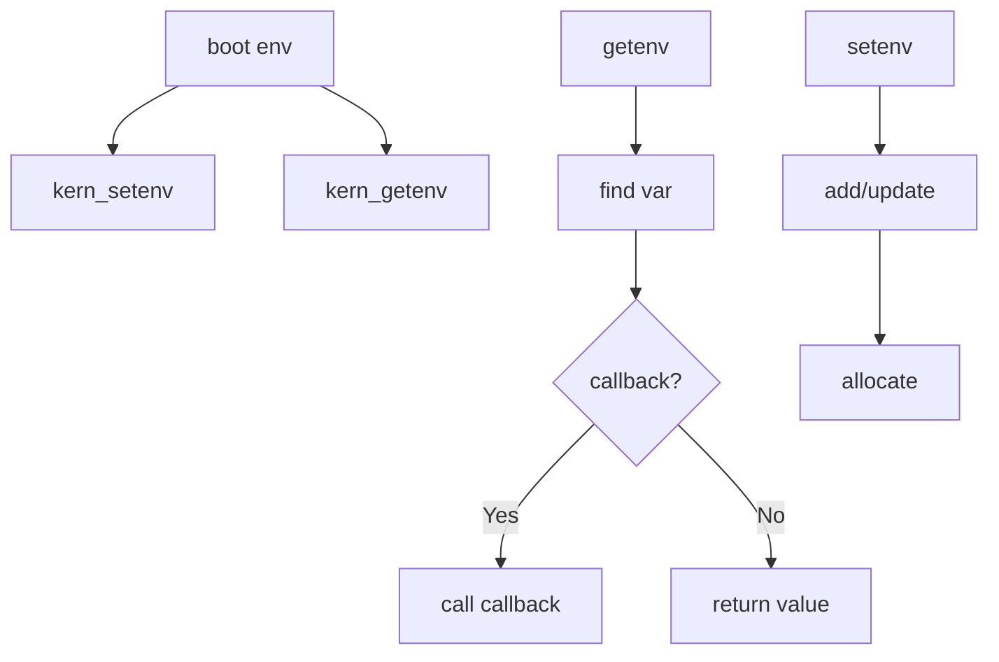

# Component: subr_boot.c

**Path:** `sys/kern/subr_boot.c`
**Type:** File
**Maps to:** `.discovery/sys/kern/subr_boot.md`

## Purpose

Boot support - environment variables and boot arguments. Provides kernel environment variable get/set, boot flag parsing, and boot configuration.

## Structure



## Key Functions

| Function | Purpose | Signature |
|----------|---------|-----------|
| `kern_getenv` | Get env | `char *kern_getenv(const char *name)` |
| `kern_setenv` | Set env | `int kern_setenv(const char *name, const char *value)` |
| `kern_unsetenv` | Unset env | `void kern_unsetenv(const char *name)` |
| `envmode` | Parse mode | `void envmode(const char *mode, uint32_t *howto)` |

## Boot Flags

| Flag | Description |
|------|-------------|
| `RB_BOOT` | Boot |
| `RB_HALT` | Halt |
| `RB_ASKNAME` | Ask name |
| `RB_SINGLE` | Single user |
| `RB_NOSYNC` | No sync |
| `RB_KDB` | Debugger |
| `RB_REROOT` | Reroot |
| `RB_MUTE` | Mute console |

## Environment

```c
struct env_var {
    char *ev_name;        // Name
    char *ev_value;      // Value
    TAILQ_ENTRY(env_var) ev_link;
};
```

## Includes

- `sys/reboot.h` - Boot flags
- `sys/boot.h` - Boot definitions

## Boot Stages

| Stage | Description |
|-------|-------------|
| `BOOT_ROM` | ROM boot |
| `BOOT_DISK` | Disk boot |
| `BOOT_NET` | Network boot |

## Depends On

- `sys/kernel.h` for kernel macros