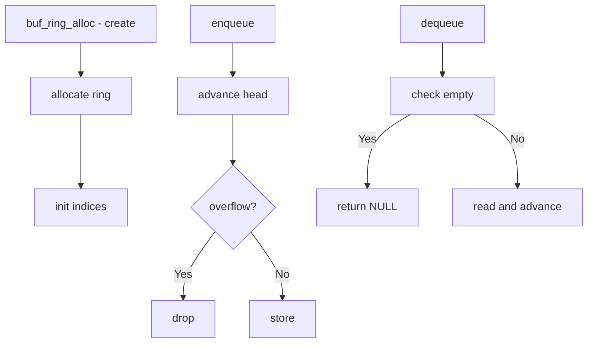

# Component: subr_bufring.c

**Path:** `sys/kern/subr_bufring.c`
**Type:** File
**Maps to:** `.discovery/sys/kern/subr_bufring.md`

## Purpose

Buffer ring - lockless circular buffer. Provides a queue for passing data between interrupt handlers and process context without locking.

## Structure



## Key Functions

| Function | Purpose | Signature |
|----------|---------|-----------|
| `buf_ring_alloc` | Allocate | `struct buf_ring *buf_ring_alloc(int count, ...)` |
| `buf_ring_free` | Free | `void buf_ring_free(struct buf_ring *br, ...)` |
| `buf_ring_enqueue` | Enqueue | `int buf_ring_enqueue(struct buf_ring *br, void *buf, int count)` |
| `buf_ring_dequeue` | Dequeue | `void *buf_ring_dequeue(struct buf_ring *br)` |

## Ring Structure

```c
struct buf_ring {
    caddr_t *br_prod_q;         // Producer queue
    caddr_t *br_cons_q;        // Consumer queue
    uint32_t br_prod_head;    // Producer head
    uint32_t br_prod_tail;    // Producer tail
    uint32_t br_cons_head;    // Consumer head
    uint32_t br_cons_tail;    // Consumer tail
    uint32_t br_prod_size;    // Size
    uint32_t br_prod_mask;    // Mask
};
```

## Operations

| Operation | Description |
|----------|-------------|
| `enqueue` | Add to ring |
| `dequeue` | Remove from ring |

## Lockless Design

| Feature | Description |
|--------|-------------|
| `MP` | Multi-producer |
| `MC` | Multi-consumer |
| `power of 2` | Size must be 2^n |

## Use Cases

| Use | Description |
|-----|-------------|
| `NETWORK` | Packet queues |
| `DISK` | I/O queues |

## Includes

- `sys/buf_ring.h` - Buffer ring definitions

## Depends On

- `sys/malloc.h` for memory