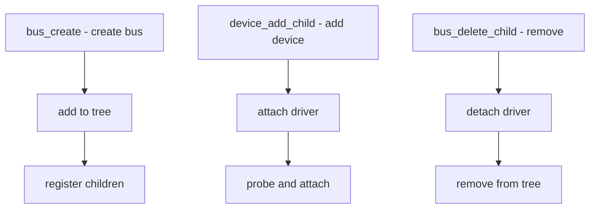

# Component: subr_bus.c

**Path:** `sys/kern/subr_bus.c`
**Type:** File
**Maps to:** `.discovery/sys/kern/subr_bus.md`

## Purpose

Bus framework - device and bus infrastructure. Provides the framework for connecting hardware drivers to devices via buses.

## Structure



## Key Functions

| Function | Purpose | Signature |
|----------|---------|-----------|
| `bus_create` | Create bus | `int bus_create(void)` |
| `device_add_child` | Add device | `device_t device_add_child(device_t parent, ...)` |
| `device_delete_child` | Remove | `int device_delete_child(device_t dev, ...)` |
| `bus_generic_attach` | Attach | `int bus_generic_attach(device_t dev)` |
| `bus_generic_detach` | Detach | `int bus_generic_detach(device_t dev)` |

## Device Structure

```c
struct device {
    struct device *dev_parent;  // Parent bus
    char *dev_name;              // Device name
    char *dev_class;            // Class
    device_t dev_driver;         // Driver
    // ...
};
```

## Bus Methods

| Method | Description |
|--------|-------------|
| `read_ivar` | Read instance var |
| `write_ivar` | Write instance var |
| `probe` | Probe device |
| `attach` | Attach driver |
| `detach` | Detach driver |

## Device States

| State | Description |
|-------|-------------|
| `BUS_PROBE` | Probing |
| `BUS_ATTACH` | Attaching |
| `BUS_READY` | Ready |

## Resource Management

| Function | Description |
|----------|-------------|
| `bus_alloc_resource` | Allocate |
| `bus_release_resource` | Release |
| `bus_set_resource` | Set |

## Includes

- `sys/bus.h` for bus definitions

## Depends On

- `sys/device.h` for device