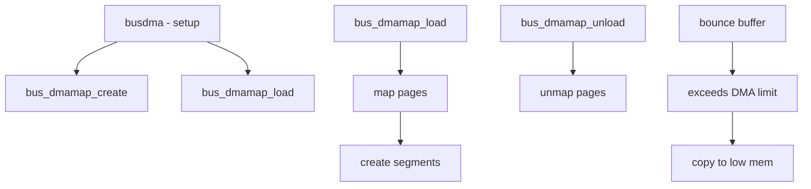

# Component: subr_bus_dma.c

**Path:** `sys/kern/subr_bus_dma.c`
**Type:** File
**Maps to:** `.discovery/sys/kern/subr_bus_dma.md`

## Purpose

Bus DMA framework - provides consistent Direct Memory Access for device drivers. Handles mapping of memory for bus transactions, bounce buffering, and scatter-gather operations.

## Structure



## Key Functions

| Function | Purpose | Signature |
|----------|---------|-----------|
| `busdma_lock_mutex` | Lock callback | `void busdma_lock_mutex(void *arg, bus_dma_lock_op_t op)` |
| `bus_dmamap_create` | Create map | `int bus_dmamap_create(bus_dma_tag_t dmat, int flags, bus_dmamap_t *mapp)` |
| `bus_dmamap_destroy` | Destroy map | `void bus_dmamap_destroy(bus_dma_tag_t dmat, bus_dmamap_t map)` |
| `bus_dmamap_load` | Load map | `int bus_dmamap_load(bus_dma_tag_t dmat, bus_dmamap_t map, void *buf, bus_size_t buflen, ...)` |
| `bus_dmamap_unload` | Unload map | `void bus_dmamap_unload(bus_dma_tag_t dmat, bus_dmamap_t map)` |
| `bus_dmamap_sync` | Sync | `void bus_dmamap_sync(bus_dma_tag_t dmat, bus_dmamap_t map, bus_dmasync_op_t op)` |
| `bus_dmamem_alloc` | Alloc DMA mem | `int bus_dmamem_alloc(bus_dma_tag_t dmat, void **vaddr, int flags, bus_dmamap_t *mapp)` |
| `bus_dmamem_free` | Free DMA mem | `void bus_dmamem_free(bus_dma_tag_t dmat, void *vaddr, bus_dmamap_t map)` |

## DMA Tag

```c
struct bus_dma_tag {
    bus_size_t alignment;      // Alignment
    bus_size_t boundary;       // Boundary
    bus_addr_t lowaddr;       // Low address
    bus_addr_t highaddr;      // High address
    bus_dma_filter_t *filter; // Filter function
    void *filterarg;          // Filter arg
    int nsegments;            // Max segments
    bus_size_t maxsegsz;      // Max seg size
    int flags;                // Flags
};
```

## DMA Map

```c
struct bus_dmamap {
    bus_size_t dmat_length;   // Length
    int dmat_nsegments;       // Segments
};
```

## Operations

| Op | Description |
|----|-------------|
| `BUS_DMA_LOCK` | Lock operation |
| `BUS_DMA_UNLOCK` | Unlock operation |

## Sync Operations

| Op | Description |
|----|-------------|
| `BUS_DMASYNC_PREREAD` | Pre-read sync |
| `BUS_DMASYNC_POSTREAD` | Post-read sync |
| `BUS_DMASYNC_PREWRITE` | Pre-write sync |
| `BUS_DMASYNC_POSTWRITE` | Post-write sync |

## Flags

| Flag | Description |
|------|-------------|
| `BUS_DMA_ALLOCNOW` | Allocate now |
| `BUS_DMA_COHERENT` | Coherent |
| `BUS_DMA_NOMINAL` | Nominal buffer |

## Bounce Buffer

| Feature | Description |
|--------|-------------|
| `bounce` | Used when mem too high |
| `sync` | Keep coherent |

## Includes

- `vm/vm.h`, `vm/vm_page.h`, `vm/vm_map.h`, `vm/pmap.h`
- `machine/bus.h` - Machine bus definitions
- `opencrypto/cryptodev.h` - Crypto device

## Depends On

- `sys/lock.h` - Locking primitives
- `vm/uma.h` - Memory allocator