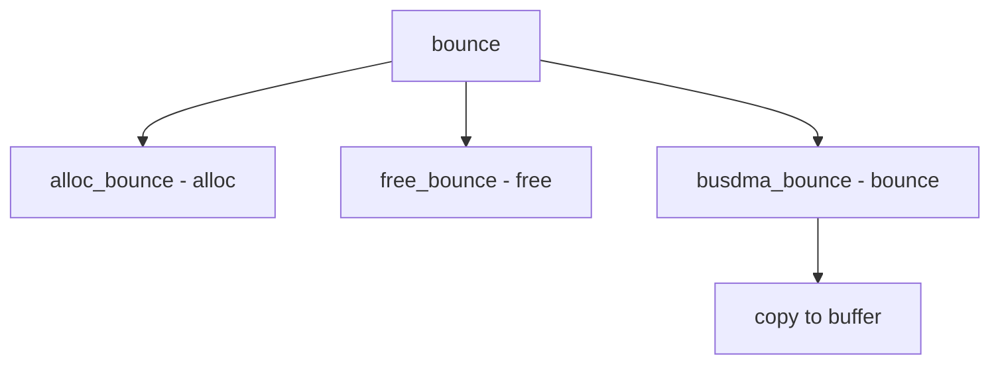

# Component: subr_busdma_bounce.c

**Path:** `sys/kern/subr_busdma_bounce.c`
**Type:** File
**Maps to:** `.discovery/sys/kern/subr_busdma_bounce.md`

## Purpose

Bus DMA bounce buffers - manages bounce buffers for DMA operations that exceed addressable memory. Included by busdma backends.

## Structure



## Key Functions

| Function | Purpose | Signature |
|----------|---------|-----------|
| `alloc_bounce` | Allocate | `int alloc_bounce(struct bus_dma_tag *tag, struct bus_dmamap *map)` |
| `free_bounce` | Free | `void free_bounce(struct bus_dma_tag *tag, struct bus_dmamap *map)` |
| `busdma_bounce` | Bounce | `void busdma_bounce(struct bus_dma_tag *tag, struct bus_dmamap *map, int op)` |

## Bounce Page

```c
struct bounce_page {
    char *vaddr;              // KVA
    bus_addr_t busaddr;       // Bus addr
    char *datavaddr;         // Data KVA
    vm_page_t datapage;       // Page
    vm_offset_t dataoffs;    // Offset
};
```

## Bounce Operations

| Op | Description |
|----|-------------|
| `BUS_DMAMAP_LOAD` | Load bounce |
| `BUS_DMAMAP_LOAD_M` | Load mbuf |

## When Bounce

| Condition | Description |
|-----------|-------------|
| `lowaddr` | Address > limit |
| `alignment` | Misaligned |

## Includes

Included by busdma backend implementations rather than compiled standalone.