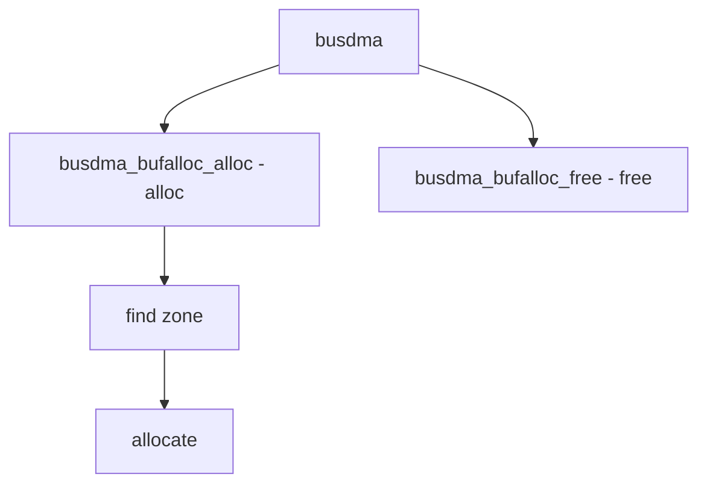

# Component: subr_busdma_bufalloc.c

**Path:** `sys/kern/subr_busdma_bufalloc.c`
**Type:** File
**Maps to:** `.discovery/sys/kern/subr_busdma_bufalloc.md`

## Purpose

Bus DMA buffer allocation - manages DMA-safe buffer zones. Allocates contiguously-aligned buffers for bus DMA.

## Structure

## Key Functions

| Function | Purpose | Signature |
|----------|---------|-----------|
| `busdma_bufalloc_alloc` | Allocate | `void *busdma_bufalloc_alloc(size_t size, int flags)` |
| `busdma_bufalloc_free` | Free | `void busdma_bufalloc_free(void *buf, size_t size)` |

## Zone Sizes

| Param | Value | Description |
|-------|-------|-------------|
| `MIN_ZONE_BUFSIZE` | 32 | Min buffer |
| `MAX_ZONE_BUFSIZE` | PAGE_SIZE | Max buffer |

## Buffer Zones

| Zones | Description |
|-------|-------------|
| `12 zones` | Power of 2 sizes |
| `32-64K` | Size range |

## Features

| Feature | Description |
|---------|-------------|
| `contiguous` | Physically contiguous |
| `aligned` | Aligned buffers |
| `zone` | Zone-based |

## Includes

- `sys/busdma_bufalloc.h` - BusDMA buffer alloc