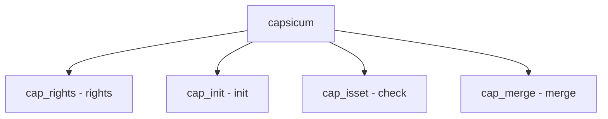

# Component: subr_capability.c

**Path:** `sys/kern/subr_capability.c`
**Type:** File
**Maps to:** `.discovery/sys/kern/subr_capability.md`

## Purpose

Capsicum - capability mode support. Defines capability rights and helper functions for capability mode.

## Structure



## Key Rights

| Right | Description |
|-------|-------------|
| `CAP_ACCEPT` | Accept |
| `CAP_BIND` | Bind |
| `CAP_CONNECT` | Connect |
| `CAP_EVENT` | Event |
| `CAP_READ` | Read |
| `CAP_WRITE` | Write |
| `CAP_SEEK` | Seek |
| `CAP_IOCTL` | IOCTL |
| `CAP_FSTAT` | Fstat |
| `CAP_MMAP` | Mmap |

## Key Functions

| Function | Purpose | Signature |
|----------|---------|-----------|
| `cap_init` | Init | `int cap_init(cap_rights_t *rightsp, ...)` |
| `cap_isset` | Check | `bool cap_isset(const cap_rights_t *rightsp, ...)` |
| `cap_merge` | Merge | `int cap_merge(cap_rights_t *dst, ...)` |
| `cap_rights_is_valid` | Validate | `bool cap_rights_is_valid(const cap_rights_t *rightsp)` |

## Capability Rights

```c
typedef struct cap_rights {
    uint64_t cr_rights[];
} cap_rights_t;
```

## Initialization

```c
CAP_RIGHTS_INITIALIZER(right)
CAP_ALL_RIGHTS()
```

## Includes

- `sys/capsicum.h` - Capsicum definitions

## Depends On

- `sys/types.h` - Types