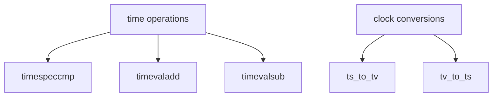

# Component: subr_clock.c

**Path:** `sys/kern/subr_clock.c`
**Type:** File
**Maps to:** `.discovery/sys/kern/subr_clock.md`

## Purpose

Clock utilities - time arithmetic and conversion functions. Provides timespeccmp, timevaladd, timevalcmp, and other time manipulation routines.

## Structure

## Key Functions

| Function | Purpose | Signature |
|----------|---------|-----------|
| `timespeccmp` | Compare timespec | `int timespeccmp(const struct timespec *a, const struct timespec *b, int op)` |
| `timespecadd` | Add timespec | `void timespecadd(struct timespec *a, const struct timespec *b)` |
| `timespecsub` | Subtract | `void timespecsub(struct timespec *a, const struct timespec *b)` |
| `timevaladd` | Add timeval | `void timevaladd(struct timeval *a, const struct timeval *b)` |
| `timevalsub` | Subtract | `void timevalsub(struct timeval *a, const struct timeval *b)` |
| `timevaltoval` | Convert | `void timevaltoval(const struct timeval *a, struct timeval *b)` |

## Time Structures

| Structure | Description |
|-----------|-------------|
| `timespec` | seconds + nanoseconds |
| `timeval` | seconds + microseconds |

## Comparison Operations

| Op | Description |
|----|-------------|
| `<` | Less than |
| `>` | Greater than |
| `==` | Equal |

## Clock Types

| Type | Description |
|------|-------------|
| `CLOCK_REALTIME` | Wall clock |
| `CLOCK_MONOTONIC` | Steadi clock |

## Sysctl

| Node | Description |
|------|-------------|
| `machdep.adjkerntz` | Adjust kernel TZ |

## Includes

- `sys/clock.h` for clock definitions

## Depends On

- `sys/time.h` for time structures