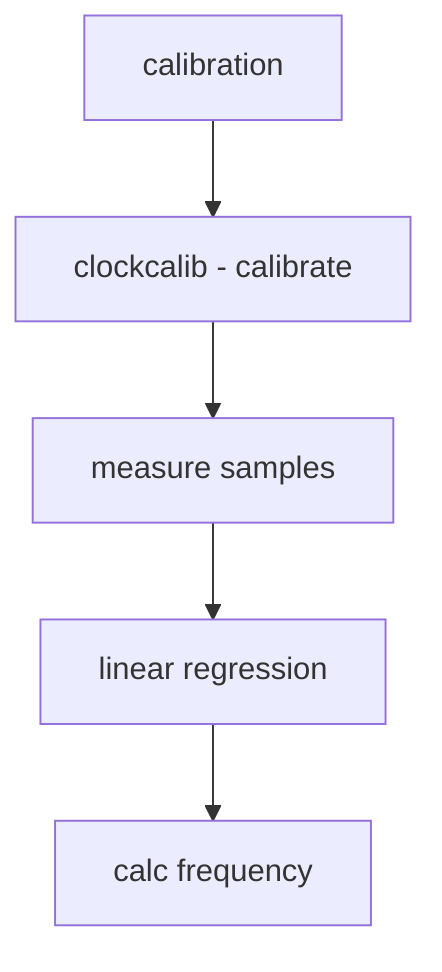

# Component: subr_clockcalib.c

**Path:** `sys/kern/subr_clockcalib.c`
**Type:** File
**Maps to:** `.discovery/sys/kern/subr_clockcalib.md`

## Purpose

Clock calibration - calibrate hardware clock frequency against timecounter. Uses linear regression for accurate frequency measurement.

## Structure

## Key Functions

| Function | Purpose | Signature |
|----------|---------|-----------|
| `clockcalib` | Calibrate | `uint64_t clockcalib(uint64_t (*clk)(void), const char *clkname)` |

## Calibration Process

| Step | Description |
|------|-------------|
| `sample` | Take multiple samples |
| `regress` | Linear regression |
| `slope` | Calculate slope |
| `freq` | Compute frequency |

## Measurement

| Parameter | Description |
|-----------|-------------|
| `mu_clk` | Mean clock |
| `mu_t` | Mean time |
| `va_clk` | Variance |
| `cva` | Co-variance |

## Use Cases

| Use | Description |
|-----|-------------|
| `TSC` | TSC calibration |
| `PMU` | PMU calibration |

## Includes

- `sys/timetc.h` - Timecounter
- `sys/tslog.h` - Timestamp logging