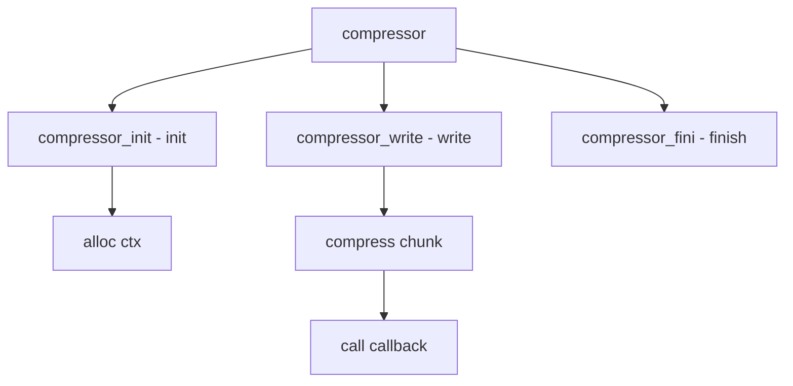

# Component: subr_compressor.c

**Path:** `sys/kern/subr_compressor.c`
**Type:** File
**Maps to:** `.discovery/sys/kern/subr_compressor.md`

## Purpose

Compression - LZ4/Zstd compression for kernel and user core dumps. Provides streaming compression with callback-based output.

## Structure



## Key Functions

| Function | Purpose | Signature |
|----------|---------|-----------|
| `compressor_init` | Init | `void *compressor_init(size_t max_output_size, int format)` |
| `compressor_reset` | Reset | `void compressor_reset(void *ctx)` |
| `compressor_write` | Write | `int compressor_write(void *ctx, void *buf, size_t len, compressor_cb_t cb, void *arg)` |
| `compressor_fini` | Finish | `int compressor_fini(void *ctx, compressor_cb_t cb, void *arg)` |

## Compressor Structure

```c
struct compressor {
    const struct compressor_methods *methods; // Methods
    compressor_cb_t cb;                       // Callback
    void *priv;                              // Private
};
```

## Methods

```c
struct compressor_methods {
    int format;                            // Format
    void *(*init)(size_t, int);          // Init
    void (*reset)(void *);               // Reset
    int (*write)(void *, void *, size_t, compressor_cb_t, void *);
    void (*fini)(void *);                // Fini
};
```

## Formats

| Format | Description |
|--------|-------------|
| `COMPRESSOR_FORMAT_LZ4` | LZ4 |
| `COMPRESSOR_FORMAT_ZSTD` | Zstd |
| `COMPRESSOR_FORMAT_GZIP` | Gzip |

## Callback

```c
typedef int (*compressor_cb_t)(void *arg, void *buf, size_t len);
```

## Use Cases

| Use | Description |
|-----|-------------|
| `coredump` | Core dump compression |
| `minidump` | Minidump |

## Includes

- `sys/compressor.h` - Compressor definitions

## Depends On

- `sys/malloc.h` - Memory allocation