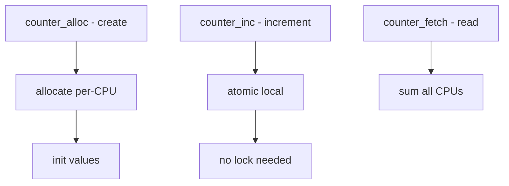

# Component: subr_counter.c

**Path:** `sys/kern/subr_counter.c`
**Type:** File
**Maps to:** `.discovery/sys/kern/subr_counter.md`

## Purpose

Per-CPU counters - efficient lockless counters. Provides counters that are incremented per-CPU without locking, then aggregated on read.

## Structure



## Key Functions

| Function | Purpose | Signature |
|----------|---------|-----------|
| `counter_u64_alloc` | Allocate | `counter_u64_t counter_u64_alloc(int flags)` |
| `counter_u64_free` | Free | `void counter_u64_free(counter_u64_t c)` |
| `counter_u64_add` | Add | `void counter_u64_add(counter_u64_t c, uint64_t v)` |
| `counter_u64_fetch` | Read sum | `uint64_t counter_u64_fetch(counter_u64_t c)` |
| `counter_u64_zero` | Zero | `void counter_u64_zero(counter_u64_t c)` |

## Counter Types

| Type | Description |
|------|-------------|
| `counter_u64_t` | 64-bit counter |
| `counter_u32_t` | 32-bit counter |

## Allocation Flags

| Flag | Description |
|------|-------------|
| `COUNTER_M_WAITOK` | Sleep ok |
| `COUNTER_M_NOWAIT` | No sleep |

## Per-CPU Structure

```c
struct counter_u64 {
    uint64_t *counter_pcpu;  // Per-CPU array
};
```

## Advantages

| Advantage | Description |
|-----------|-------------|
| `lockless` | No atomic for inc |
| `cache line` | Per-CPU, no bounce |

## Uses

| Use | Description |
|-----|-------------|
| `ifstats` | Network stats |
| `sysctl` | Statistics |

## Includes

- `sys/counter.h` - Counter definitions

## Depends On

- `vm/uma.h` for allocation