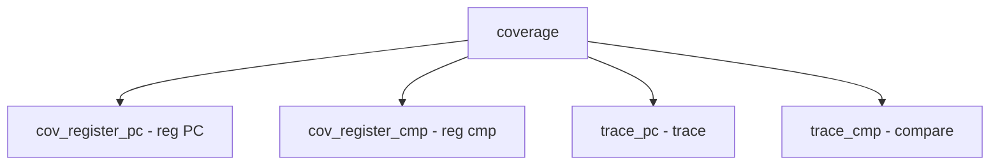

# Component: subr_coverage.c

**Path:** `sys/kern/subr_coverage.c`
**Type:** File
**Maps to:** `.discovery/sys/kern/subr_coverage.md`

## Purpose

Coverage tracking - SanitizerCoverage support for kernel. Provides coverage callbacks for sanitizer tools.

## Structure

## Key Functions

| Function | Purpose | Signature |
|----------|---------|-----------|
| `cov_register_pc` | Register PC | `void cov_register_pc(cov_trace_pc_t trace_pc)` |
| `cov_register_cmp` | Register cmp | `void cov_register_cmp(cov_trace_cmp_t trace_cmp)` |
| `cov_trace_pc` | PC trace | `void __sanitizer_cov_trace_pc(void)` |
| `cov_trace_cmp1` | Cmp 1 | `void __sanitizer_cov_trace_cmp1(uint8_t a, uint8_t b)` |
| `cov_trace_cmp2` | Cmp 2 | `void __sanitizer_cov_trace_cmp2(uint16_t a, uint16_t b)` |
| `cov_trace_cmp4` | Cmp 4 | `void __sanitizer_cov_trace_cmp4(uint32_t a, uint32_t b)` |
| `cov_trace_cmp8` | Cmp 8 | `void __sanitizer_cov_trace_cmp8(uint64_t a, uint64_t b)` |

## Callbacks

| Type | Description |
|------|-------------|
| `cov_trace_pc_t` | PC trace callback |
| `cov_trace_cmp_t` | Compare callback |

## Coverage Types

| Type | Description |
|------|-------------|
| `trace_pc` | Program counter |
| `trace_cmp` | Comparison |

## Use Cases

| Use | Description |
|-----|-------------|
| `sanitizer` | SanitizerCoverage |
| `fuzzing` | Fuzzing |

## Includes

- `sys/coverage.h` - Coverage definitions