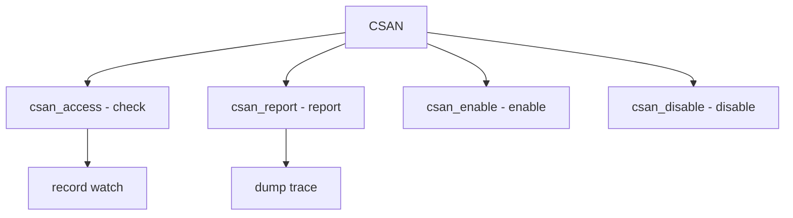

# Component: subr_csan.c

**Path:** `sys/kern/subr_csan.c`
**Type:** File
**Maps to:** `.discovery/sys/kern/subr_csan.md`

## Purpose

Concurrent checking (CSAN) - KernelAddressSantizer for detecting data races. Monitors memory accesses and reports races.

## Structure



## Key Functions

| Function | Purpose | Signature |
|----------|---------|-----------|
| `csan_access` | Check access | `void csan_access(uintptr_t addr, uint32_t size, bool write, bool atomic)` |
| `csan_report` | Report | `void csan_report(const char *msg)` |
| `csan_enable` | Enable | `void csan_enable(void)` |
| `csan_disable` | Disable | `void csan_disable(void)` |

## CSAN Event

```c
typedef struct {
    uintptr_t addr;      // Address
    uint32_t size;       // Size
    bool write:1;       // Write
    bool atomic:1;      // Atomic
} csan_event_t;
```

## Report Mode

| Mode | Description |
|------|-------------|
| `KCSAN_PANIC` | Panic on race |
| `REPORT` | Printf |

## Watch Types

| Type | Description |
|------|-------------|
| `write` | Write access |
| `atomic` | Atomic op |

## Use Cases

| Use | Description |
|-----|-------------|
| `debug` | Race detection |
| `testing` | Stress testing |

## Includes

- `sys/csan.h` - CSAN definitions

## Depends On

- `sys/smp.h` - SMP support