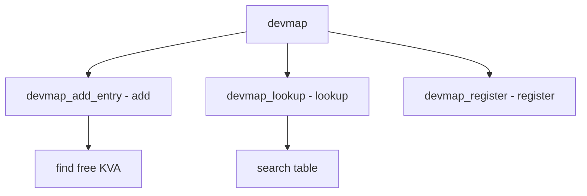

# Component: subr_devmap.c

**Path:** `sys/kern/subr_devmap.c`
**Type:** File
**Maps to:** `.discovery/sys/kern/subr_devmap.md`

## Purpose

Device memory mapping - manages static device memory mappings. Provides allocation and lookup of device physical to virtual address mappings.

## Structure



## Key Functions

| Function | Purpose | Signature |
|----------|---------|-----------|
| `devmap_add_entry` | Add mapping | `int devmap_add_entry(vm_paddr_t pa, vm_size_t size)` |
| `devmap_lookup` | Lookup | `int devmap_lookup(vm_paddr_t pa)` |
| `devmap_register` | Register | `int devmap_register(intptr_t idx, vm_paddr_t pa, vm_size_t size)` |
| `devmap_mapdev` | Map device | `int devmap_mapdev(void *va, vm_paddr_t pa, vm_size_t size)` |

## Devmap Entry

```c
struct devmap_entry {
    vm_paddr_t de_pa;         // Physical
    vm_size_t de_size;        // Size
    vm_offset_t de_va;        // Virtual
};
```

## AKVA Table

| Constant | Description |
|----------|-------------|
| `AKVA_DEVMAP_MAX_ENTRIES` | Max entries (32) |
| `DEVMAP_MAX_VADDR` | Max KVA |

## Flags

| Flag | Description |
|------|-------------|
| `DEVMAP_PADDR_NOTFOUND` | Not found |

## Use Cases

| Use | Description |
|-----|-------------|
| `ARM` | ARM devices |
| `embedded` | Embedded systems |

## Includes

- `sys/devmap.h` - Devmap definitions
- `vm/pmap.h` - Physical map