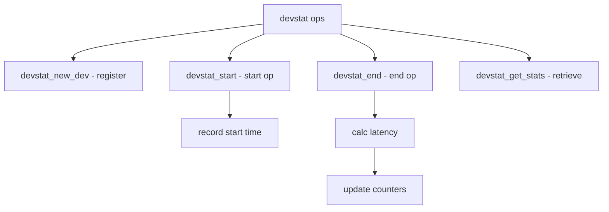

# Component: subr_devstat.c

**Path:** `sys/kern/subr_devstat.c`
**Type:** File
**Maps to:** `.discovery/sys/kern/subr_devstat.md`

## Purpose

Device statistics - I/O statistics collection for devices. Tracks operations, bytes, latency, and queue depth for disk and other devices.

## Structure



## Key Functions

| Function | Purpose | Signature |
|----------|---------|-----------|
| `devstat_new_dev` | Register device | `struct devstat *devstat_new_dev(struct device *dev, ...)` |
| `devstat_start` | Start op | `void devstat_start(struct devstat *dev, struct bio *bp)` |
| `devstat_end` | End op | `void devstat_end(struct devstat *dev, struct devstat_entry *entry)` |
| `devstat_get_stats` | Get stats | `void devstat_get_stats(struct devstat *dev, struct devstat_stats *stats)` |
| `devstat_remove_dev` | Remove device | `void devstat_remove_dev(struct devstat *dev)` |

## Device Stat Structure

```c
struct devstat {
    struct device *device;         // Device
    uint64_t bytes[DTK_NTIMES];   // Bytes
    uint64_t operations[DTK_NTIMES]; // Operations
    struct timespec start_time;    // Start
    struct timespec end_time;      // End
    int busy;                      // Busy flag
    struct queue一辈子 |*queue;         // Queue
};
```

## Device Types

| Type | Description |
|------|-------------|
| `DEVSTAT_TYPE_DIRECT` | Direct I/O |
| `DEVSTAT_TYPE_SEQUENTIAL` | Sequential |
| `DEVSTAT_TYPE_CONNECTION` | Network |

## Flags

| Flag | Description |
|------|-------------|
| `DEVSTAT_ALL_SUPPORTED` | All supported |
| `DEVSTAT_NO_ORDER` | No order |
| `DEVSTAT_BS_NONE` | No block size |

## DTrace Probes

| Probe | Description |
|-------|-------------|
| `io:start` | I/O start |
| `io:done` | I/O done |

## Includes

- `sys/devicestat.h` - Devstat definitions
- `sys/disk.h` - Disk definitions

## Depends On

- `sys/conf.h` - Conf definitions
- `sys/lock.h` - Locking