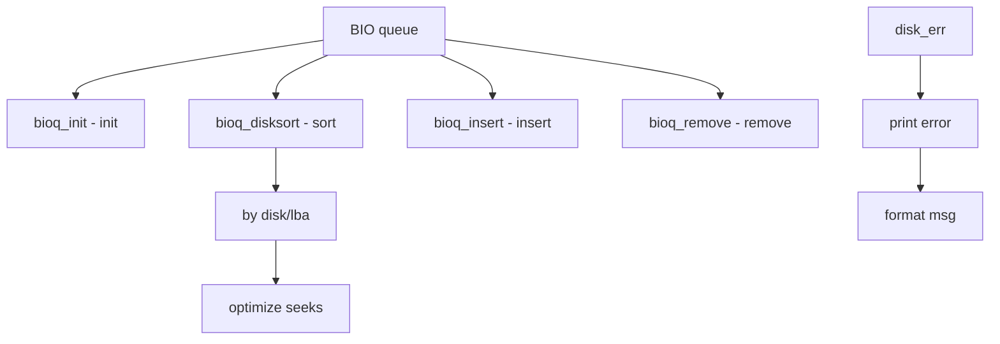

# Component: subr_disk.c

**Path:** `sys/kern/subr_disk.c`
**Type:** File
**Maps to:** `.discovery/sys/kern/subr_disk.md`

## Purpose

Disk support - disk error handling and BIO queue sorting. Provides disk_err() for error messages and bioq_disksort() for elevator sorting.

## Structure



## Key Functions

| Function | Purpose | Signature |
|----------|---------|-----------|
| `disk_err` | Print error | `void disk_err(struct bio *bp, const char *what, int blkdone, int nl)` |
| `bioq_init` | Init queue | `void bioq_init(struct bio_queue *bq)` |
| `bioq_disksort` | Sort BIO | `void bioq_disksort(struct bio_queue *bq, struct bio *bp)` |
| `bioq_insert` | Insert BIO | `void bioq_insert(struct bio_queue *bq, struct bio *bp)` |
| `bioq_remove` | Remove BIO | `struct bio *bioq_remove(struct bio_queue *bq)` |
| `bioq_first` | Peek first | `struct bio *bioq_first(struct bio_queue *bq)` |

## BIO Queue Structure

```c
struct bio_queue {
    struct bio *bq_first;    // First
    struct bio *bq_last;     // Last
    int bq_count;            // Count
};
```

## BIO Commands

| Command | Description |
|---------|-------------|
| `BIO_READ` | Read |
| `BIO_WRITE` | Write |
| `BIO_DELETE` | Delete |
| `BIO_GETATTR` | Get attribute |
| `BIO_FLUSH` | Flush |

## Bio Structure

```c
struct bio {
    struct bio *bio_link;    // Link
    struct cdev *bio_dev;    // Device
    struct disk *bio_disk;   // Disk
    daddr_t bio_pblkno;      // Physical block
    long bio_bcount;         // Byte count
    int bio_cmd;             // Command
    int bio_error;           // Error
};
```

## Batch Size

| Setting | Description |
|---------|-------------|
| `bioq_batchsize` | Batch size (default 128) |

## Includes

- `sys/bio.h` - BIO definitions
- `sys/disk.h` - Disk definitions
- `geom/geom_disk.h` - GEOM disk