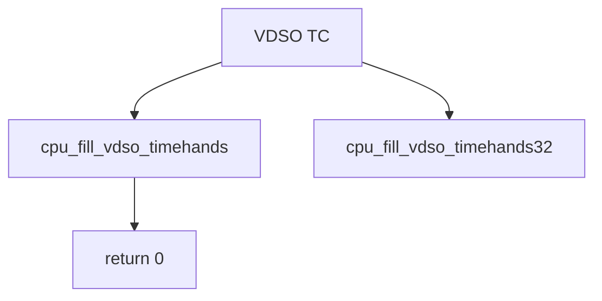

# Component: subr_dummy_vdso_tc.c

**Path:** `sys/kern/subr_dummy_vdso_tc.c`
**Type:** File
**Maps to:** `.discovery/sys/kern/subr_dummy_vdso_tc.md`

## Purpose

Dummy VDSO timecounter - stub implementation for platforms without VDSO support. Returns 0 to indicate no VDSO.

## Structure

## Key Functions

| Function | Purpose | Signature |
|----------|---------|-----------|
| `cpu_fill_vdso_timehands` | Fill timehands | `uint32_t cpu_fill_vdso_timehands(struct vdso_timehands *vdso_th, struct timecounter *tc)` |
| `cpu_fill_vdso_timehands32` | Fill 32-bit | `uint32_t cpu_fill_vdso_timehands32(struct vdso_timehands32 *vdso_th32, struct timecounter *tc)` |

## Return Value

| Value | Description |
|-------|-------------|
| `0` | VDSO not supported |

## VDSO

| Feature | Description |
|---------|-------------|
| `vdso` | Virtual dynamic shared object |
| `timehands` | Time counter |

## Use Cases

| Use | Description |
|-----|-------------|
| `non-VDSO` | Platforms without VDSO |
| `fallback` | Fallback implementation |

## Includes

- `sys/vdso.h` - VDSO definitions