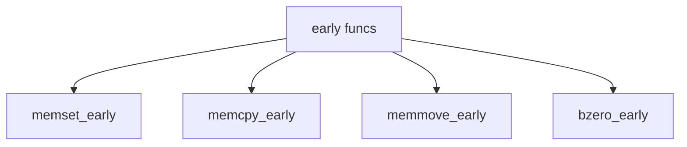

# Component: subr_early.c

**Path:** `sys/kern/subr_early.c`
**Type:** File
**Maps to:** `.discovery/sys/kern/subr_early.md`

## Purpose

Early memory functions - memset, memcpy, memmove for early boot before full kernel is running. Used before VM is initialized.

## Structure

## Key Functions

| Function | Purpose | Signature |
|----------|---------|-----------|
| `memset_early` | Set memory | `void *memset_early(void *buf, int c, size_t len)` |
| `memcpy_early` | Copy memory | `void *memcpy_early(void *to, const void *from, size_t len)` |
| `memmove_early` | Move memory | `void *memmove_early(void *to, const void *from, size_t len)` |
| `bzero_early` | Zero bytes | `void bzero_early(void *buf, size_t len)` |

## Custom Implementations

| Macro | Description |
|-------|-------------|
| `MEMSET_EARLY_FUNC` | Custom memset |
| `MEMCPY_EARLY_FUNC` | Custom memcpy |
| `MEMMOVE_EARLY_FUNC` | Custom memmove |
| `BZERO_EARLY_FUNC` | Custom bzero |

## Use Cases

| Use | Description |
|-----|-------------|
| `boot` | Early boot |
| `loader` | Boot loader |

## Includes

- `machine/cpu.h` - CPU headers