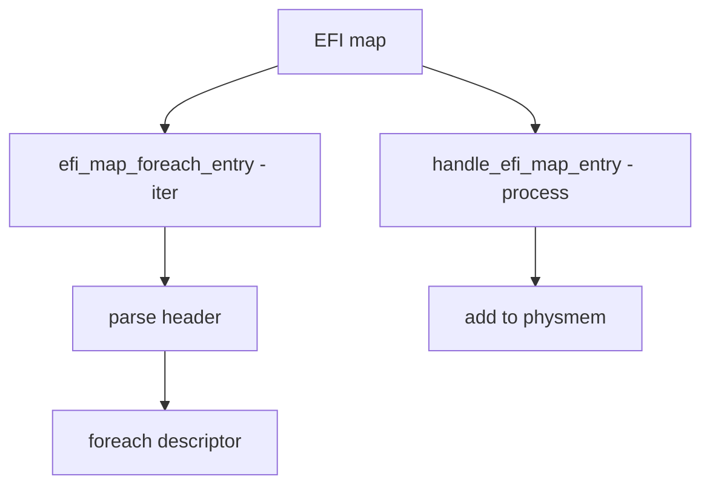

# Component: subr_efi_map.c

**Path:** `sys/kern/subr_efi_map.c`
**Type:** File
**Maps to:** `.discovery/sys/kern/subr_efi_map.md`

## Purpose

UEFI memory map - parses UEFI memory map and populates physical memory descriptors. Handles runtime firmware memory reservations.

## Structure

## Key Functions

| Function | Purpose | Signature |
|----------|---------|-----------|
| `efi_map_foreach_entry` | Iterate | `void efi_map_foreach_entry(struct efi_map_header *efihdr, efi_map_entry_cb cb, void *argp)` |
| `handle_efi_map_entry` | Process entry | `void handle_efi_map_entry(struct efi_md *p, void *argp)` |

## EFI Memory Types

| Type | Description |
|------|-------------|
| `EFI_MD_TYPE_RT` | Runtime |
| `EFI_MD_TYPE_RTM` | RT memory |
| `EFI_MD_TYPE_RE` | Reserved |
| `EFI_MD_TYPE_UC` | Uncached |
| `EFI_MD_TYPE_WC` | Write-combining |
| `EFI_MD_TYPE_WT` | Write-through |
| `EFI_MD_TYPE_WB` | Write-back |
| `EFI_MD_TYPE_UCE` | UCE |

## Two-Pass Processing

| Pass | Action |
|------|--------|
| First | Add valid memory to physmem |
| Second | Exclude reserved ranges |

## Includes

- `sys/efi.h` - EFI definitions
- `sys/efi_map.h` - EFI map
- `machine/efi.h` - Machine EFI