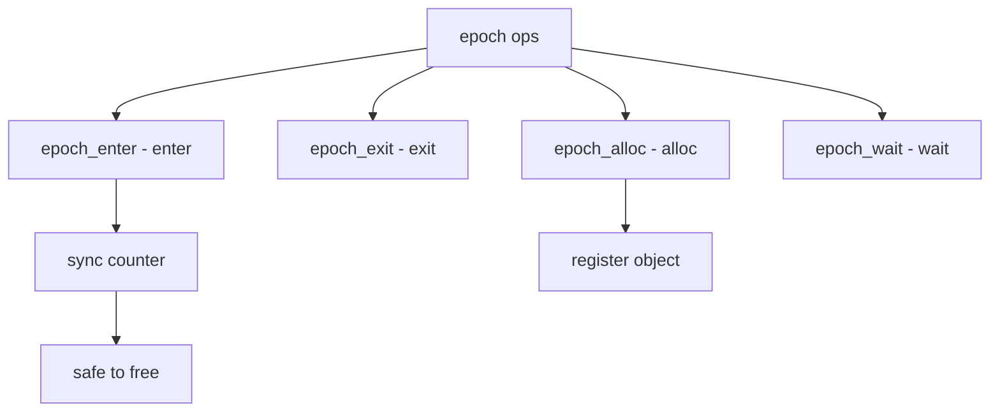

# Component: subr_epoch.c

**Path:** `sys/kern/subr_epoch.c`
**Type:** File
**Maps to:** `.discovery/sys/kern/subr_epoch.md`

## Purpose

Epoch synchronization - lock-free epoch-based memory reclamation. Provides a safe way to free objects that may be accessed concurrently without locks.

## Structure



## Key Functions

| Function | Purpose | Signature |
|----------|---------|-----------|
| `epoch_init` | Init | `void epoch_init(struct epoch *ep, const char *name)` |
| `epoch_enter` | Enter | `void epoch_enter(struct epoch *ep, struct epoch_context *ctx)` |
| `epoch_exit` | Exit | `void epoch_exit(struct epoch_context *ctx)` |
| `epoch_alloc` | Alloc | `struct epoch_context *epoch_alloc(int flags)` |
| `epoch_free` | Free | `void epoch_free(struct epoch_context *ctx, void *ptr, ...)` |
| `epoch_wait` | Wait | `void epoch_wait(struct epoch *ep)` |

## Epoch Structure

```c
struct epoch {
    const char *name;            // Name
    struct mtx lock;            // Lock
    uint64_t global;            // Global
    uint64_t *cpuid_epoch;     // Per-CPU
};
```

## Epoch Context

```c
struct epoch_context {
    uint64_t epoch;             // Epoch
    TAILQ_ENTRY(epoch_context) link; // Link
};
```

## Callbacks

| Callback | Description |
|----------|-------------|
| `epoch_call` | Schedule callback |
| `epoch_drain` | Drain callbacks |

## Features

| Feature | Description |
|---------|-------------|
| `lock-free` | No locks for read |
| `SMR` | Safe Memory Reclamation |
| `per-CPU` | Per-CPU counters |

## Use Cases

| Use | Description |
|-----|-------------|
| `net epoch` | Network objects |
| `taskqueue` | Deferred tasks |

## Includes

- `ck_epoch.h` - Chemoff epochs
- `sys/epoch.h` - Epoch definitions

## Depends On

- `sys/lock.h` - Locking
- `sys/smp.h` - SMP support