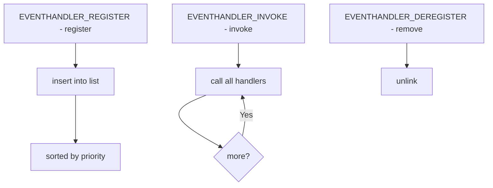

# Component: subr_eventhandler.c

**Path:** `sys/kern/subr_eventhandler.c`
**Type:** File
**Maps to:** `.discovery/sys/kern/subr_eventhandler.md`

## Purpose

Event handler framework - provides callback registration for system events. Allows subsystems to register callbacks that are invoked when specific events occur.

## Structure



## Key Functions

| Function | Purpose | Signature |
|----------|---------|-----------|
| `eventhandler_register` | Register | `void *eventhandler_register(struct eventhandler_list *list, ...)` |
| `eventhandler_deregister` | Unregister | `void eventhandler_deregister(struct eventhandler_list *list, void *handle)` |
| `eventhandler_invoke` | Invoke | `void eventhandler_invoke(struct eventhandler_list *list)` |

## Event Handler List

```c
struct eventhandler_list {
    TAILQ_ENTRY(eventhandler_list) el_link;
    const char *el_name;
    TAILQ_HEAD(, eventhandler_entry) el_entries;
};
```

## Event Handler Entry

```c
struct eventhandler_entry {
    TAILQ_ENTRY(eventhandler_entry) ee_link;
    struct eventhandler_list *ee_list;
    int ee_priority;
};
```

## Priority Levels

| Priority | Description |
|----------|-------------|
| `EVHPRI_FIRST` | Highest |
| `EVHPRI_NORMAL` | Normal |
| `EVHPRI_LAST` | Lowest |

## Common Events

| Event | Description |
|-------|-------------|
| `process_exit` | Process exits |
| `thread_exit` | Thread exits |
| `shutdown_pre_sync` | Pre-sync shutdown |
| `mountctl` | Mount control |

## Uses

| Use | Description |
|-----|-------------|
| `jail` | Jail events |
| `ACPI` | Power events |

## Includes

- `sys/eventhandler.h` - Event handler definitions

## Depends On

- `sys/mutex.h` for locking