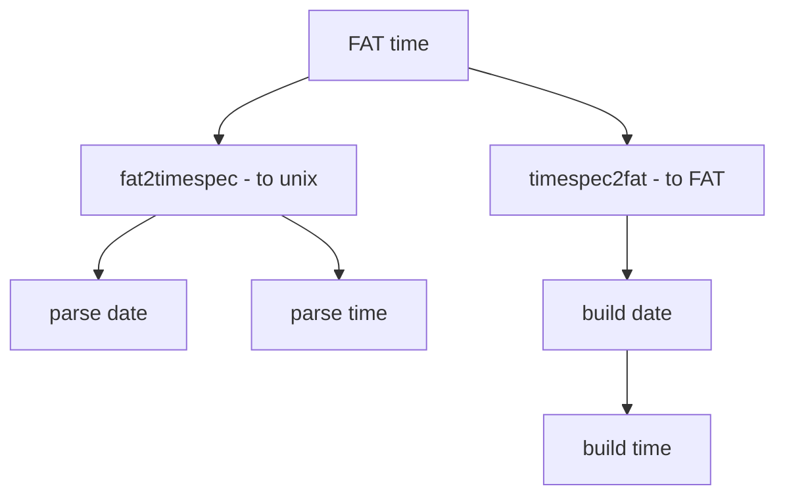

# Component: subr_fattime.c

**Path:** `sys/kern/subr_fattime.c`
**Type:** File
**Maps to:** `.discovery/sys/kern/subr_fattime.md`

## Purpose

FAT timestamp conversion - converts between DOS FAT timestamps and Unix timespec. Used by FAT filesystem for file timestamps.

## Structure



## Key Functions

| Function | Purpose | Signature |
|----------|---------|-----------|
| `fat2timespec` | FAT to timespec | `void fat2timespec(const struct fat_datetime *fat, struct timespec *ts)` |
| `fat2fntimespec` | FAT to fname | `void fat2fntimespec(const struct fat_datetime *fat, struct timespec *ts)` |
| `timespec2fat` | Timespec to FAT | `void timespec2fat(const struct timespec *ts, int utc, struct fat_datetime *fat)` |
| `timespec2fnfat` | Timespec to fname | `void timespec2fnfat(const struct timespec *ts, int utc, struct fat_datetime *fat)` |

## FAT Date

```c
struct fat_datetime {
    uint16_t year;    // Year (1980-2107)
    uint16_t month;   // Month (1-12)
    uint16_t day;     // Day (1-31)
    uint16_t hour;    // Hour (0-23)
    uint16_t min;     // Minute (0-59)
    uint16_t sec;     // Second (0-59)
};
```

## FAT Format

| Field | Bits | Range |
|-------|------|-------|
| Year | 7 | 0-127 + 1980 |
| Month | 4 | 1-12 |
| Day | 5 | 1-31 |
| Hour | 5 | 0-23 |
| Minute | 6 | 0-59 |
| Second | 5 | 0-29 (2sec units) |

## UTC vs Local

| Flag | Description |
|------|-------------|
| `0` | Local timezone |
| `1` | UTC |

## Includes

- `sys/time.h` - Time definitions
- `sys/stat.h` - Stat definitions