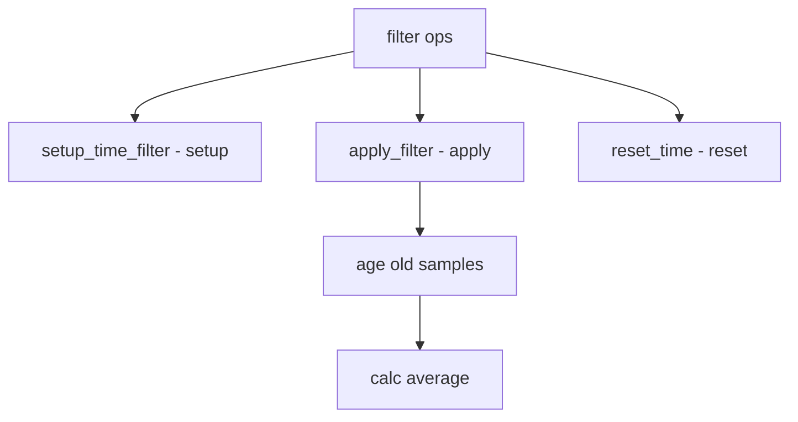

# Component: subr_filter.c

**Path:** `sys/kern/subr_filter.c`
**Type:** File
**Maps to:** `.discovery/sys/kern/subr_filter.md`

## Purpose

Time filter - exponential moving average filters for RTT, bandwidth, and other metrics. Provides min/max tracking over a time window.

## Structure



## Key Functions

| Function | Purpose | Signature |
|----------|---------|-----------|
| `setup_time_filter` | Setup | `void setup_time_filter(struct time_filter *tf, int type, uint32_t time_len)` |
| `apply_filter` | Apply | `uint32_t apply_filter(struct time_filter *tf, uint32_t new_val, uint32_t now)` |
| `apply_filter_min` | Apply min | `uint32_t apply_filter_min(struct time_filter *tf, uint32_t new_val, uint32_t now)` |
| `apply_filter_max` | Apply max | `uint32_t apply_filter_max(struct time_filter *tf, uint32_t new_val, uint32_t now)` |
| `reset_time` | Reset | `void reset_time(struct time_filter *tf, uint32_t time_len)` |

## Filter Types

| Type | Description |
|------|-------------|
| `FILTER_TYPE_MIN` | Minimum |
| `FILTER_TYPE_MAX` | Maximum |
| `FILTER_TYPE_AVG` | Average |

## Time Filter

```c
struct time_filter {
    uint32_t last_in;           // Last input
    uint32_t cur_val;           // Current
    uint32_t cur_time_limit;   // Time limit
    uint32_t total;             // Total
    uint32_t nsamp;            // Samples
};
```

## Time Filter Small

```c
struct time_filter_small {
    uint32_t cur_time_limit;   // Time limit
    uint32_t last_out;        // Last output
    uint32_t last_in;         // Last input
    uint32_t fwd_sz;         // Size
};
```

## Use Cases

| Use | Description |
|-----|-------------|
| `TCP RTT` | Round trip time |
| `TCP CWND` | Congestion window |
| `BW estimation` | Bandwidth |

## Includes

- `sys/tim_filter.h` - Time filter definitions

## Depends On

- `sys/time.h` - Time definitions