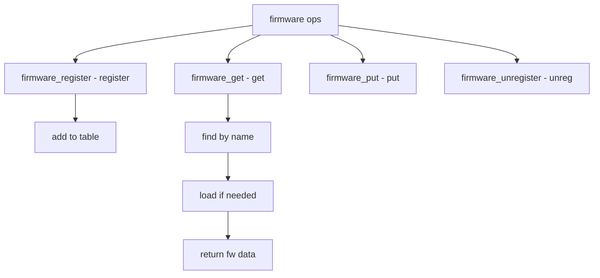

# Component: subr_firmware.c

**Path:** `sys/kern/subr_firmware.c`
**Type:** File
**Maps to:** `.discovery/sys/kern/subr_firmware.md`

## Purpose

Firmware loading - loadable firmware support for device drivers. Provides firmware registration, lookup, and loading from files or embedded data.

## Structure



## Key Functions

| Function | Purpose | Signature |
|----------|---------|-----------|
| `firmware_register` | Register | `struct firmware *firmware_register(const char *name, ...)` |
| `firmware_get` | Get firmware | `const struct firmware *firmware_get(const char *name)` |
| `firmware_put` | Put firmware | `void firmware_put(const struct firmware *fw, int flags)` |
| `firmware_unregister` | Unregister | `void firmware_unregister(const char *name)` |
| `firmware_load` | Load | `int firmware_load(const char *name, int flags)` |

## Firmware Structure

```c
struct firmware {
    const char *name;           // Name
    const void *data;          // Data
    size_t size;                // Size
    int version;                // Version
    const char *digest;         // Digest
};
```

## Priv Firmware

```c
struct priv_fw {
    struct firmware fw;         // Public
    TAILQ_ENTRY(priv_fw) link; // Link
    int refs;                   // Refs
};
```

## Flags

| Flag | Description |
|------|-------------|
| `FW_NOWAIT` | No wait |
| `FW_ASK` | Ask |
| `FW_LOAD` | Load |
| `FW_DUPOK` | Duplicate ok |

## Loading

| Method | Description |
|--------|-------------|
| `embedded` | Built-in |
| `file` | From file |

## Event Handlers

| Handler | Description |
|---------|-------------|
| `firmware_config` | Config event |
| `firmware_unload` | Unload event |

## Includes

- `sys/firmware.h` - Firmware definitions
- `sys/linker.h` - Linker definitions

## Depends On

- `sys/eventhandler.h` - Events
- `sys/taskqueue.h` - Task queues