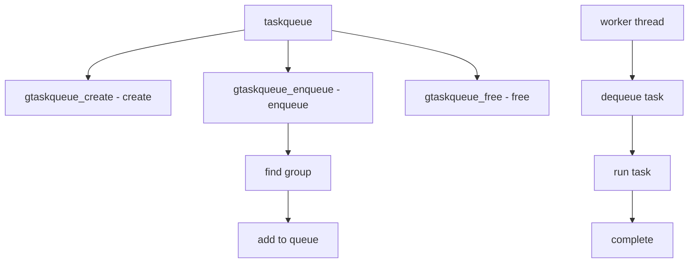

# Component: subr_gtaskqueue.c

**Path:** `sys/kern/subr_gtaskqueue.c`
**Type:** File
**Maps to:** `.discovery/sys/kern/subr_gtaskqueue.md`

## Purpose

Grouped taskqueue - per-CPU taskqueue with grouping. Tasks are grouped by CPU and executed by dedicated threads.

## Structure



## Key Functions

| Function | Purpose | Signature |
|----------|---------|-----------|
| `gtaskqueue_create` | Create | `struct gtaskqueue *gtaskqueue_create(const char *name, ...)` |
| `gtaskqueue_enqueue` | Enqueue | `void gtaskqueue_enqueue(struct gtaskqueue *queue, struct gtask *task)` |
| `gtaskqueue_free` | Free | `void gtaskqueue_free(struct gtaskqueue *queue)` |
| `gtaskqueue_drain` | Drain | `void gtaskqueue_drain(struct gtaskqueue *queue, struct gtask *task)` |
| `taskqueue` | Submit | `int taskqueue(struct taskqueue **tqpp, struct task *task)` |

## Task Structure

```c
struct gtask {
    TAILQ_ENTRY(gtask) ta_link;     // Link
    void (*ta_func)(void *, int);  // Func
    void *ta_context;               // Context
    int ta_flags;                   // Flags
};
```

## Taskqueue Structure

```c
struct gtaskqueue {
    const char *tq_name;          // Name
    struct mtx tq_lock;          // Lock
    TAILQ_HEAD(, gtask) tq_queue; // Queue
    struct gtaskqueue_group *tq_groups; // Groups
    int tq_threadcount;           // Threads
};
```

## Taskqueue Groups

| Group | Description |
|-------|-------------|
| `softirq` | Soft IRQ tasks |
| `fast` | Fast tasks |
| `bpf` | BPF tasks |

## Task Flags

| Flag | Description |
|------|-------------|
| `GTASKQUEUE_` | Task flags |

## Includes

- `sys/gtaskqueue.h` - Grouped taskqueue definitions

## Depends On

- `sys/epoch.h` - Epoch
- `sys/smp.h` - SMP